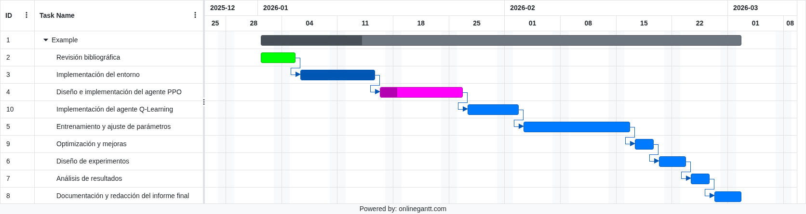

# Aplicación de Aprendizaje por Refuerzo (PPO) al juego Universal Paperclips

**Código del proyecto:** Paperclips

**Integrantes:** Alvarez Rossetti Lucía, Padilla Gonzalo

## Descripción del problema

Universal Paperclips es un juego incremental donde el jugador produce y vende clips de papel, avanzando desde tareas manuales hasta la automatización total mediante algoritmos. El objetivo del juego es maximizar la producción y eficiencia a lo largo de distintas etapas, en las cuales el jugador debe decidir cuándo invertir, automatizar o cambiar precios para mejorar su rendimiento.

Este entorno resulta ideal para aplicar técnicas de aprendizaje por refuerzo (RL), ya que las decisiones tienen un efecto acumulativo en el tiempo y el agente debe aprender a equilibrar la exploración de nuevas estrategias con la explotación de aquellas que generan mejores resultados.

## Objetivos

**Principales:**

* Lograr que el agente complete el juego de manera autónoma.

**Secundarios:**

* Optimizar el agente para que complete el juego en el tiempo más corto posible.

## Alcance

El proyecto se centrará en la implementación del entorno del juego Universal Paperclips en una versión simplificada (uno o dos niveles) fuera de la web, permitiendo su ejecución como entorno de simulación para entrenamiento de agentes.

Incluye la configuración, experimentación y entrenamiento de un agente basado en PPO, empleando librerías de aprendizaje por refuerzo preexistentes, y la posterior comparación con un agente de Q-Learning.

Se realizarán pruebas después de los entrenamientos para evaluar la efectividad de ambos modelos y analizar los resultados según las métricas definidas.

El trabajo no abarca la integración con la interfaz web original ni la simulación completa de todas las etapas del juego, sino una representación acotada que permita medir el desempeño de los algoritmos de manera controlada.

## Limitaciones del problema

* Estrategias complejas y no triviales, donde las decisiones iniciales afectan el desempeño futuro del agente.

* Tres etapas con mecánicas diferentes, lo que dificulta la adaptación de un mismo modelo a todo el juego.

* Gran cantidad de acciones y variables, con más de 70 acciones posibles y alrededor de 200 variables relevantes, lo que aumenta la complejidad computacional y el riesgo de sobreajuste.

## Métricas

Las métricas seleccionadas permiten comparar distintos enfoques y configuraciones de entrenamiento, identificando cuál ofrece el mejor equilibrio entre rendimiento, estabilidad y eficiencia.

* Win rate (porcentaje de partidas completadas con éxito): evalúa la consistencia del modelo para resolver el entorno y alcanzar la meta de forma estable.

* Recompensa acumulada promedio: mide el rendimiento global del modelo en función de los resultados obtenidos a lo largo de cada partida, reflejando su capacidad para maximizar los objetivos del juego. La recompensa podría estar influenciada por la cantidad de clips producidos, tasa de producción de clips, lograr pasar de nivel, etc.

* Tiempo o cantidad de pasos. Representa la eficiencia del agente, ya que un modelo más eficaz debería alcanzar el objetivo en menos tiempo y cantidad de pasos.

## Experimentos

En primer lugar, se entrenará un agente basado en Q-Learning para establecer una línea base de rendimiento. Este agente servirá como punto de comparación frente al modelo principal.

Posteriormente, se entrenará un agente PPO (Proximal Policy Optimization) en múltiples sesiones de juego —por ejemplo, mil partidas de entrenamiento y un conjunto de cien partidas de prueba— con el objetivo de analizar su capacidad de aprendizaje, estabilidad y eficiencia.

También se realizarán variaciones simples sobre los parámetros principales del modelo, como la tasa de aprendizaje, el número de pasos por actualización o el grado de exploración, con el fin de observar cómo estos cambios afectan las métricas de desempeño. 

Finalmente, se compararán los resultados obtenidos en términos de win rate, recompensa promedio y cantidad de acciones necesarias para completar el juego, evaluando qué configuración permite un entrenamiento más estable y eficiente.

## Marco Teórico

El aprendizaje por refuerzo (RL) es una técnica de aprendizaje automático donde un agente aprende a actuar en un entorno mediante prueba y error, buscando maximizar una recompensa acumulada.

A diferencia del aprendizaje supervisado, no se le indican respuestas correctas, sino que el agente ajusta su comportamiento a partir de la retroalimentación obtenida.

En este trabajo se emplea el algoritmo Proximal Policy Optimization (PPO), un método actor-crítico que mejora la estabilidad del entrenamiento limitando los cambios bruscos en la política del agente.

PPO resulta especialmente adecuado para entornos incrementales y dinámicos como Universal Paperclips, donde las decisiones secuenciales y la adaptación continua son esenciales para optimizar el desempeño y reducir el tiempo necesario para completar el juego.

## Justificación

El problema requiere que un agente tome decisiones secuenciales en un entorno dinámico.

El uso de PPO permite que el agente aprenda estrategias óptimas de forma autónoma y estable, algo que no podría lograrse eficazmente mediante reglas fijas o enfoques deterministas.

## Herramientas 

* Node.js: para replicar la lógica base del juego Universal Paperclips
* Código original: decisionproblem.com/paperclips/main.js y la versión modificada alojada en GitHub – jgmize/paperclips.
* Gymnasium: para evitar conexiones con el juego real y la necesidad de una interfaz gráfica.
* Entrenamiento del Agente: Deberán analizarse con mayor profundidad antes de seleccionar la más adecuada
* Stable-Baselines3
* TensorFlow.js, tfjs-rl 
* reinforce-js
* RLlib
* Express
* Socket.io
* TensorBoard

## Actividades

1. Revisión bibliográfica y análisis de enfoques existentes en RL y PPO. [5 días]

1. Implementación base del entorno de Universal Paperclips en Node.js / Gymnasium. [10 días]

1. Diseño e implementación del agente. [10 días]

1. Implementación y prueba del agente Q-Learning como referencia. [5 días]

1. Entrenamiento inicial del agente y ajuste de parámetros. [14 días]

1. Optimización y mejoras (normalización de variables, tuning). [4 días]

1. Diseño de experimentos comparativos PPO vs Q-Learning. [3 días]

1. Análisis de resultados y evaluación de métricas definidas. [4 días]

1. Documentación técnica y redacción del informe final. [4 días]

Gnatt

## Referencias

Link al juego:

- https://www.decisionproblem.com/paperclips/

Código del juego:

- https://github.com/jgmize/paperclips
