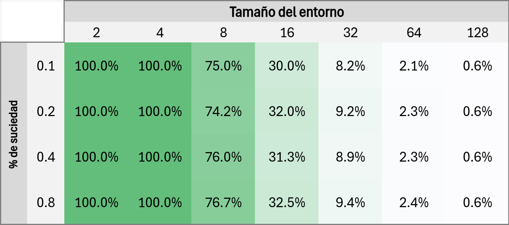
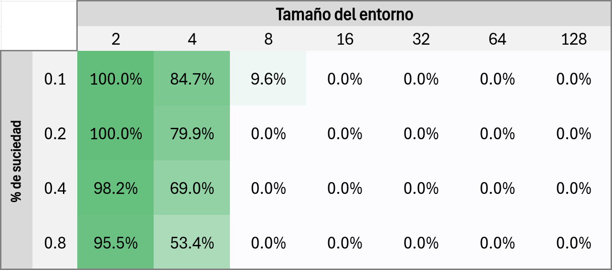
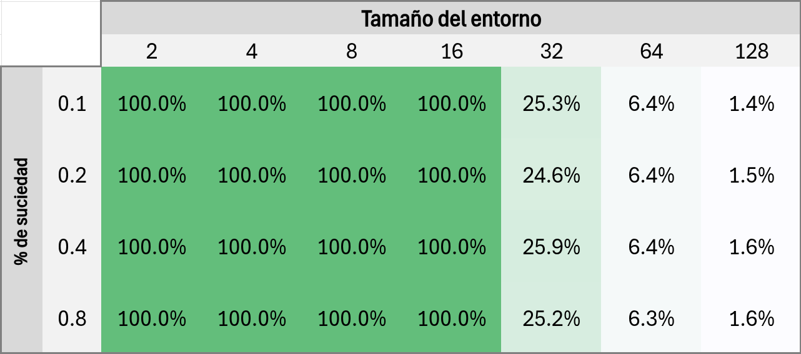
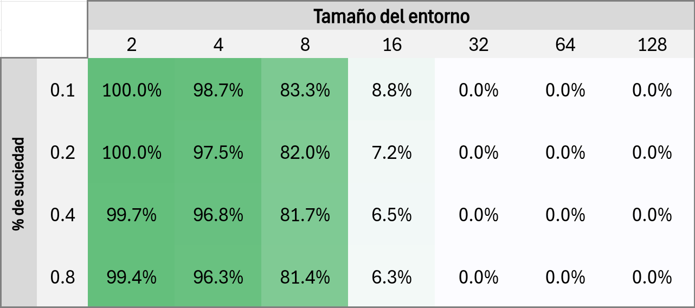
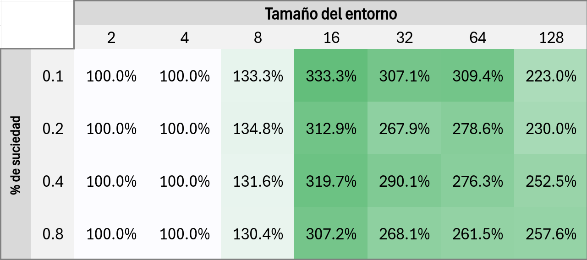
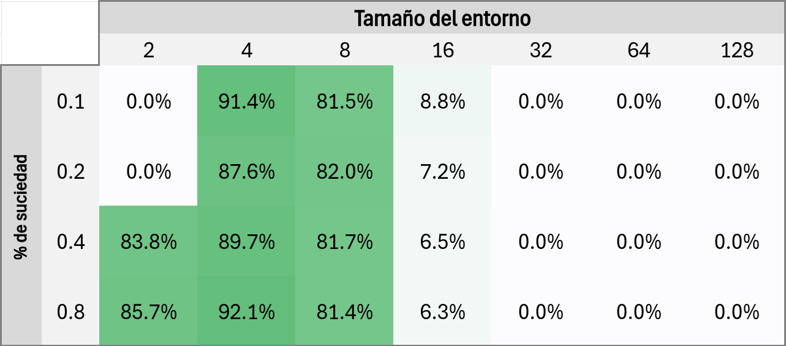

# Trabajo Práctico 2
## Evaluación de desempeño de agentes

## 1, Descripción de los agentes

### 1.1 Agente aleatorio

En cada iteración, el agente aleatorio toma una de seis acciones posibles, seleccionadas al azar con igual probabilidad. Las mismas son: moverse a la izquierda, derecha, arriba, abajo, succionar tierra, o no hacer nada. En todos los casos se consume un acción.

### 1.2 Agente reflexivo simple

El agente implementado no utiliza memoria ni accede a la percepción global del entorno, solo utiliza percepción local. El mismo intenta recorrer toda la grilla, siguiendo un patrón recursivo. Asume que la grilla es del mayor tamaño posible (128 × 128), y resuelve recursivamente cada cuarto de la misma, empezando por el cuarto en el que se encuentre. De la misma forma, resuelve ese cuarto, dividiéndolo en 4 partes y resolviéndolas en sentido horario, empezando por la sección en la que se encuentre, hasta llegar al caso base, que es el de una única celda.

Utiliza la cantidad de acciones consumidas para saber casi exactamente cuántas celdas a recorrido (hay un poco de repetición inevitable, pero que se puede tener en cuenta).

Como el patrón que sigue es exacto (recursivo y en sentido horario), sabiendo cuántas celdas ha recorrido, permite saber _cuáles_ fueron las mismas.

El patrón que sigue no es perfecto, ya que consume aproximadamente 2Nlog25/4 más acciones que un patrón que no repita celdas. También tiene la desventaja de que consume una acción (la de no hacer nada), cada vez que encuentra una celda limpia. Esto es necesario para que a partir del número de acciones realizadas, pueda calcular cuántas celdas a recorrido. Recorrer y limpiar una celda sucia consume dos acciones, por lo que debe desperdiciar una acción en las celdas que encuentra limpias para poder realizar este cálculo (de esta forma, dividiendo por dos, obtiene la cantidad de celdas recorridas).

### 2. Descripción de la prueba de desempeño

Se realizaron simulaciones para los siguientes tamaños de grilla y porcentajes de suciedad del ambiente:

* Entornos de: 2 × 2, 4 × 4, 8 × 8, 16 × 16, 32 × 32, 64 × 64, 128 × 128.
* Porcentaje de suciedad en el ambiente: 0.1, 0.2, 0.4, 0.8

Para cada combinación, se realizaron 10 simulaciones por cada agente. Se utilizaron las mismas 10 semillas para ambos agentes en cada caso, tal que fuesen comparados en iguales condiciones.

## 3. Resultados

### 3.1 Desempeño del agente aleatorio

El agente aleatorio consumió en promedio 32,2 acciones por celda limpiada.

La siguiente tabla muestra el porcentaje de celdas sucias que fueron limpiadas por el agente en los distintos escenarios.

Se observa que logró limpiar el 100% de las celdas sucias para todos los casos con grillas de dimensiones 2 × 2 y 4 × 4. Obtuvo un rendimiento razonable para grillas de dimensión 8 × 8. Y no logró limpiar más de un tercio de las celdas sucias para grillas de 16 × 16 o mayores. El rendimiento fue consistente para un mismo tamaño de grilla, independientemente del porcentaje de suciedad.

La siguiente tabla muestra el porcentaje de acciones restantes al completar cada escenario.

Las dos celdas con 100% en la esquina superior izquierda se deben a que esos escenarios nunca tenían suciedad, por lo que automáticamente ambos agentes cumplieron su objetivo sin gastar acciones.

Puede verse que el agente completa el objetivo para grillas de tamaño 2 × 2 habiendo gastado pocas de sus acciones. Algo similar ocurre para las grillas de tamaño 2 × 2, aunque con peor rendimiento para entornos con más suciedad, ya que limpiar tal suciedad consume más acciones. Sin embargo, para grillas de tamaño 8 × 8 o más, el agente no alcanza a cumplir su objetivo en casi ningún caso, por lo que agota todas sus acciones.

### 3.2 Desempeño del agente reflexivo simple

El agente reflexivo simple consumió en promedio 10,0 acciones por celda limpiada.

La siguiente tabla muestra el porcentaje de celdas sucias que fueron limpiadas por el agente en los distintos escenarios.

Se observa que logró limpiar el 100% de las celdas sucias para todos los casos con grillas de dimensiones 16 × 16 o menores, considerablemente mejor que el agente aleatorio. Esto se debe a que este agente es capaz de recorrer toda la grilla, de forma sistemática, sin muchas repeticiones.

Sin embargo, a partir de las grillas de tamaño 32 × 32, el agente comienza a agotar sus accione antes de poder recorrer todo el entorno, por lo que su rendimiento se degrada rápidamente.

La siguiente tabla muestra el porcentaje de acciones restantes al completar cada escenario.

Las dos celdas con 100% en la esquina superior izquierda se deben a que esos escenarios nunca tenían suciedad, por lo que automáticamente ambos agentes cumplieron su objetivo sin gastar acciones.

Puede verse que el agente completa el objetivo para grillas de tamaño 8 × 8 habiendo gastado pocas de sus acciones. Logra completar las grillas de tamaño 16 × 16, aunque con muy pocas acciones restantes. Al igual que en el caso del agente aleatorio, se observa un leve peor rendimiento para entornos con mayor suciedad, ya que limpiar es considerada una acción. Para grillas de tamaño 32 × 32 o más, el agente no alcanza a cumplir su objetivo en casi ningún caso, por lo que agota todas sus acciones.

### 2.3 Comparación de desempeños

Comparando la cantidad promedio de acciones requeridas por celda limpiada, vemos que el agente aleatorio requiere 3,2 veces más acciones que el reflexivo simple.

La siguiente tabla muestra la mejora porcentual de cantidad de celdas limpiadas por el agente reflexivo en comparación al aleatorio en los distintos escenarios.

Se observa que para las grillas de tamaño 4 × 4 y menores, no hay mejora ya que ambos logran completar su objetivo. Para las grillas de tamaño 8 × 8, el agente reflexivo logra limpiar aproximadamente un 30% más de celdas. La diferencia es máxima en el caso de las grillas de tamaño 16 × 16, ya que el agente reflexivo es capaz de completarlas en todos los escenarios, mientras que el aleatorio apenas logra completar un tercio, obteniéndose un rendimiento un poc más de tres veces mayor.

A partir de las grillas de 32 × 32, ambos agentes fallan en completar sus objetivos debido a que agotan sus acciones, sin embargo el agente reflexivo mantiene un rendimiento consistentemente mayor al aleatorio, de entre dos a tres veces más celdas limpiadas.

La siguiente tabla muestra el porcentaje de reducción de acciones utilizadas para el agente reflexivo respecto al aleatorio.

Se observa que, para los casos en que ambos agentes logran completar sus objetivos (grillas igual o menores a 4 × 4), el agente reflexivo logra hacerlo con una reducción de entre 80% y 90% en la cantidad de acciones utilizadas. En el caso de la grilla 8 × 8, el agente aleatorio no logra completar su objetivo, mientras que el reflexivo sí, y habiendo gastado pocas acciones, por lo tanto aquí también la diferencia es grande.

Para grillas de 16 × 16, aunque el agente reflexivo logra completar su objetivo, mientras que el aleatorio solo en un 30%, la diferencia se reduce debido a que el primero solo lo logra habiendo consumido casi todas sus acciones. Para grillas mayores, ambos agentes fracasan en limpiar toda la grilla, debido al agotamiento de acciones, por lo que la diferencia es cero.

## 4. Conclusión

Los resultados muestran que el agente reflexivo simple es considerablemente más capaz de lograr su objetivo que el aleatorio. No solo es capaz de limpiar completamente las grillas de tamaños de hasta 16 × 16, sino que en los casos en que ambos agentes logran sus objetivo, el agente reflexivo simple lo hace consumiendo entre un 80% y 90% menos acciones. En promedio, el agente reflexivo simple obtuvo un rendimiento de 10,0 acciones por celda limpiada, mientras que el aleatorio requirió 32,2 acciones.