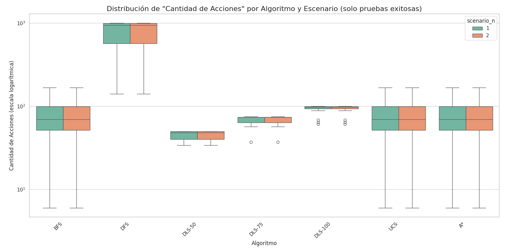
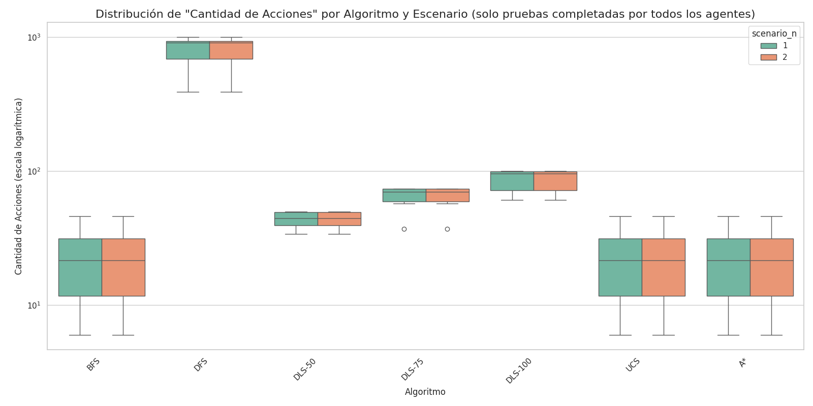
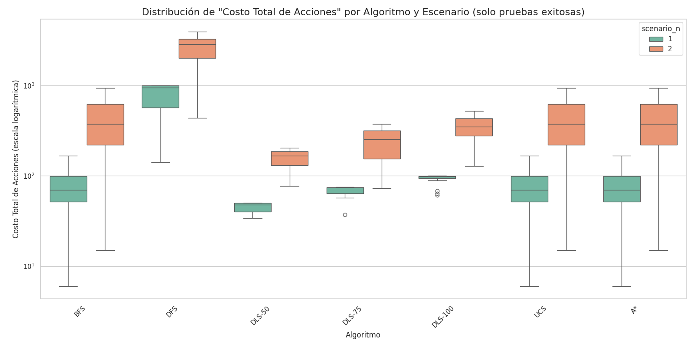
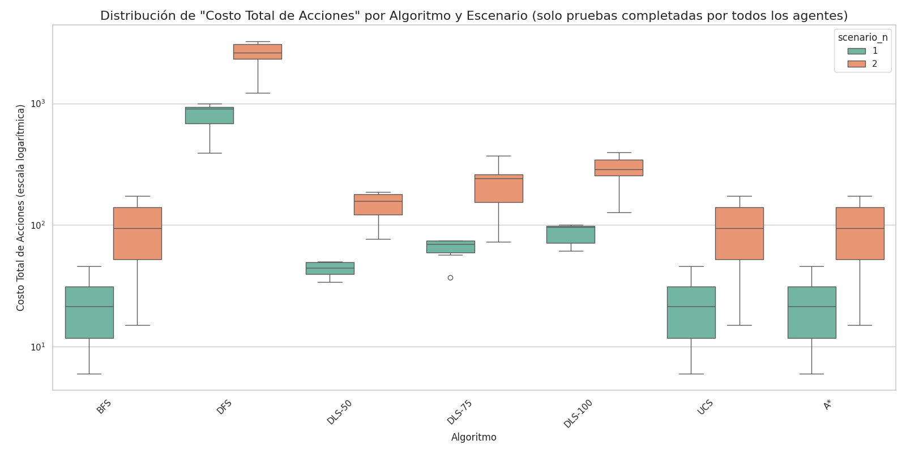
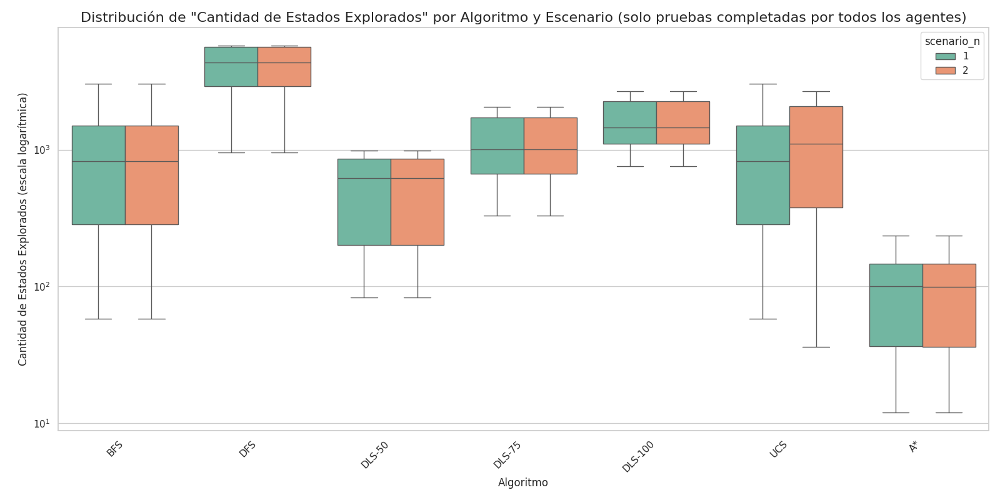
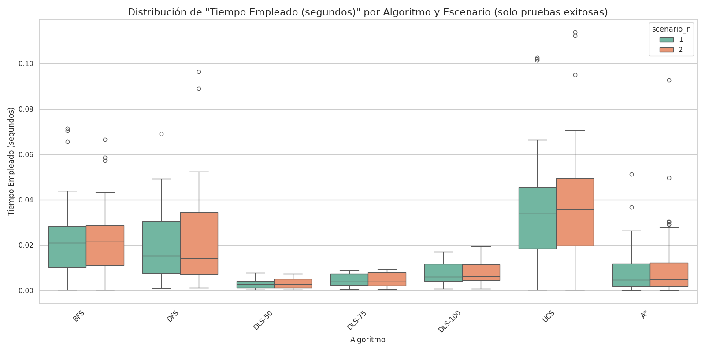
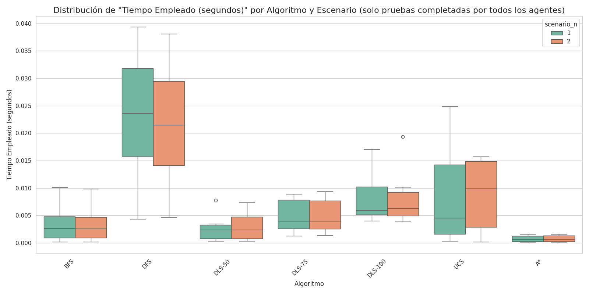
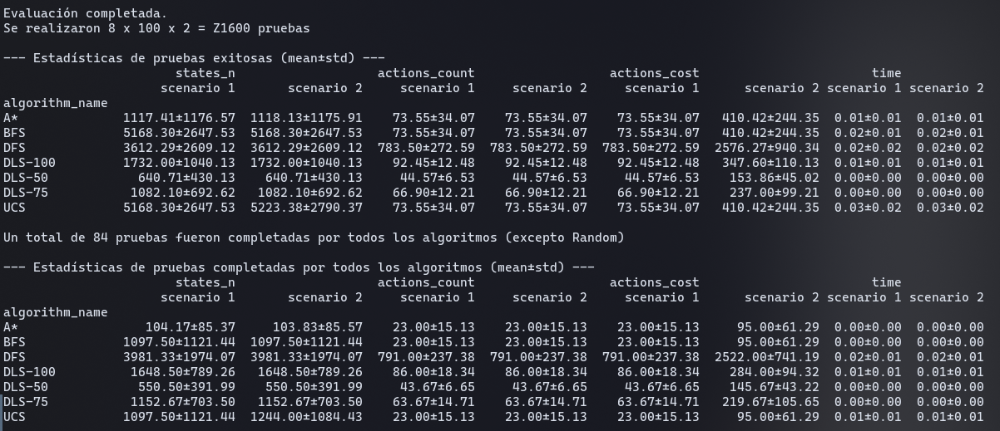

# Trabajo Práctico 3: Búsqueda no informada e informada

## Evaluación de desempeño de los algoritmos

## 1. Introducción

Se comparó el desempeño de distintos algoritmos de búsqueda. Fueron evaluados en 100 mapas distintos, y a su vez, para cada mapa, en dos escenarios con distintas funciones de costo para las acciones posibles. En el primer escenario, cada acción tenía costo 1. Mientras que en el segundo, los movimientos horizontales tenían costo 1, y los verticales, 10.

Los algoritmos evaluados fueron:

    1. Búsqueda aleatoria
    2. Búsqueda por Anchura (BFS)
    3. Búsqueda por Profundidad (DPS)
    4. Búsqueda por Profundidad Limitada (límites = 50, 75 y 100) (DLS)
    5. Búsqueda de Costo Uniforme (UCS)
    6. Búsqueda A*

Los entornos utilizados tenían un tamaño de 100 x 100, con una probabilidad de 0.92 de que una celda sea transitable, y 0.08 de que sea un obstáculo. Al agente se le configuró una vida máxima de 1000 acciones.

## 2. Resultados

El algoritmo de búsqueda aleatoria solo fue capaz de completar una prueba de las 100, por lo que fue descartado del análisis.

### 2.1 Cantidad de acciones por algoritmo y escenario

La siguiente figura muestra cuántas acciones tomaron los distintos algoritmos para llegar al objetivo, en cada tipo de escenario. Para cada algoritmo, solo se consideraron pruebas en las que se haya encontrado una solución dentro del límite de acciones máximo establecido.

La siguiente tabla muestra la media y la desviación estándar de la cantidad de acciones tomadas por algoritmo, por escenario, solo para pruebas completadas.

| algorithm_name |    scenario 1 |    scenario 2 |
|----------------|---------------|---------------|
| BFS            |   73.55±34.07 |   73.55±34.07 |
| DFS            | 783.50±272.59 | 783.50±272.59 |
| DLS-50         |    44.57±6.53 |    44.57±6.53 |
| DLS-75         |   66.90±12.21 |   66.90±12.21 |
| DLS-100        |   92.45±12.48 |   92.45±12.48 |
| UCS            |   73.55±34.07 |   73.55±34.07 |
| A*             |   73.55±34.07 |   73.55±34.07 |

### Análisis

Se observa que el algoritmo que requirió más acciones fue el de búsqueda en profundidad (DFS), con una media de 791,00 acciones, un orden de magnitud peor que el siguiente con peor rendimiento, que fue el de búsqueda limitada en profundidad con un límite de 100 acciones (DLS-100). Los algoritmos de búsqueda en profundidad (BFS), búsqueda de costo uniforme (UCS) y A* tuvieron exactamente el mismo rendimiento, habiendo encontrado en todos los casos el camino más corto posible.

En un primer análisis, pareciera que los algoritmos de búsqueda limitados por profundidad (DLS-50, DLS-75 y DLS-100) superaron al resto. Sin embargo, esto se debe a un sesgo en el muestreo realizado. Los algoritmos DFS, BFS, UCS y A* resolvieron todas las pruebas, mientras que los distintos DLS únicamente las más sencillas. Por lo tanto, estamos comparando el rendimiento de DLS en las pruebas más sencillas (distancia corta del inicio al objetivo), con el rendimiento de los demás algoritmos en todas las pruebas (tanto fáciles como difíciles). Si filtramos los resultados teniendo en cuenta únicamente las pruebas resueltas por todos los algoritmos (exceptuando el de búsqueda aleatoria), obtenemos los siguiente resultados.

Media y desviación estándar de cantidad de acciones tomadas por algoritmo, por escenario, solo para pruebas completadas por todos los algoritmos.

| algorithm_name |    scenario 1 |    scenario 2 |
|----------------|---------------|---------------|
| BFS            |   23.00±15.13 |   23.00±15.13 |
| DFS            | 791.00±237.38 | 791.00±237.38 |
| DLS-50         |    43.67±6.65 |    43.67±6.65 |
| DLS-75         |   63.67±14.71 |   63.67±14.71 |
| DLS-100        |   86.00±18.34 |   86.00±18.34 |
| UCS            |   23.00±15.13 |   23.00±15.13 |
| A*             |   23.00±15.13 |   23.00±15.13 |

Con esta comparación más justa, se observa que BFS, UCS y A* son significativamente mejores que los distintos DLS. DFS sigue siendo un orden de diferencia peor que DLS-100, el segundo peor. Esto coincide con lo esperado, ya que BFS, UCS y A*, en el escenario 1, deberían encontrar siempre el camino de menor cantidad de acciones.

Se esperaba que para el escenario 2, que tiene una función de costo no uniforme, los algoritmos UCS y A* posiblemente consumiesen más acciones que BFS con el fin de minimizar el costo total de acciones, pero esta situación no ocurrió en ninguna de las pruebas. Esto se debe a la elección de tamaño del entorno y de la probabilidad de obstáculos. La configuración elegida hace que sea muy poco frecuente que el camino de menor costo sea uno que implique mayor cantidad de acciones. Por lo tanto, los resultados fueron idénticos para ambos escenarios.

El mal rendimiento de DFS se debe que no garantiza encontrar el camino más corto, si no alguna solución cualquiera, que puede estar lejos de la óptima. En comparación, en DLS, al tener un límite de profundidad, si la solución que se está explorando es demasiado larga (aunque fuese posiblemente válida, y aceptada en DFS), la misma es descartada, y se explora una distinta, posiblemente más corta. Aunque descartar soluciones de esta manera, puede causar que estos algoritmos descarten las únicas soluciones posibles.

### 2.2 Costo total de acciones por algoritmo y escenario

La siguiente figura muestra el costo total de las acciones que tomaron los distintos algoritmos para llegar al objetivo, en cada tipo de escenario. Solo se consideran pruebas en las que los algoritmos hayan encontrado una solución dentro del límite de acciones máximo establecido.

La siguiente tabla muestra la media y la desviación estándar del costo total de acciones tomadas por algoritmo, por escenario, solo para pruebas completadas.

| algorithm_name |    scenario 1 |     scenario 2 |
|----------------|---------------|----------------|
| BFS            |   73.55±34.07 |  410.42±244.35 |
| DFS            | 783.50±272.59 | 2576.27±940.34 |
| DLS-50         |    44.57±6.53 |   153.86±45.02 |
| DLS-75         |   66.90±12.21 |   237.00±99.21 |
| DLS-100        |   92.45±12.48 |  347.60±110.13 |
| UCS            |   73.55±34.07 |  410.42±244.35 |
| A*             |   73.55±34.07 |  410.42±244.35 |

### Análisis

Obtenemos resultado similares que para la cantidad de acciones, siendo DFS el algoritmo que más costo acumuló, mientras que BFS, UCS y A* tuvieron rendimientos iguales, y DLS-50 y DLS-75 tuvieron el mejor rendimiento. Nuevamente, esto último se debe al mismo sesgo de selección ya explicado en la sección anterior. Por otro lado, vemos que el costo total de acciones es mucho mayor en el escenario 2 que en el 1, debido a su función de costo, lo cuál era lo esperado.

Se esperaba que para el escenario 2, UCS y A* encontrasen soluciones con mayor cantidad de acciones pero menor costo total de las mismas. Pero por la misma razón que la explicada en la sección anterior (selección particular de tamaño de grilla y de probabilidad de obstáculos), esto se debe únicamente a la poca probabilidad, dadas las condiciones de prueba, de que el camino de menor cantidad de acciones requiera mayor costo. Por lo tanto, BFS en este caso, también encuentra la solución de menor costo.

Al igual que lo ya explicado, los distintos DLS tienen mejor rendimiento que DFS debido al descarte temprano de soluciones de mucha cantidad de acciones, aunque esto hace que no pudiesen resolver gran parte de las pruebas, al descartar en muchos casos las únicas soluciones posibles.

Si nos limitamos únicamente a las pruebas completadas por todos los agentes, obtenemos los siguientes resultados.

Media y desviación estándar de costo total de acciones tomadas por algoritmo, por escenario, solo para pruebas completadas por todos los algoritmos.

| algorithm_name |    scenario 1 |     scenario 2 |
|----------------|---------------|----------------|
| BFS            |   23.00±15.13 |    95.00±61.29 |
| DFS            | 791.00±237.38 | 2522.00±741.19 |
| DLS-50         |    43.67±6.65 |   145.67±43.22 |
| DLS-75         |   63.67±14.71 |  219.67±105.65 |
| DLS-100        |   86.00±18.34 |   284.00±94.32 |
| UCS            |   23.00±15.13 |    95.00±61.29 |
| A*             |   23.00±15.13 |    95.00±61.29 |

Con esta corrección, vemos que efectivamente BFS, UCS y A* tienen mejor rendimiento que los distintos DLS para ambos escenarios, y DFS sigue siendo el algoritmo con peor rendimiento.

### 2.3 Cantidad de estados explorados por algoritmo y escenario

La siguiente figura muestra la cantidad de estados explorados por los distintos algoritmos para llegar al objetivo, en cada tipo de escenario. Solo se consideran pruebas en las que los algoritmos hayan encontrado una solución dentro del límite de acciones máximo establecido.

La siguiente tabla muestra la media y la desviación estándar de la cantidad de estados explorados por cada algoritmo, por escenario, solo para pruebas completadas.

| algorithm_name |      scenario 1 |      scenario 2 |
|----------------|-----------------|-----------------|
| BFS            | 5168.30±2647.53 | 5168.30±2647.53 |
| DFS            | 3612.29±2609.12 | 3612.29±2609.12 |
| DLS-50         |   640.71±430.13 |   640.71±430.13 |
| DLS-75         |  1082.10±692.62 |  1082.10±692.62 |
| DLS-100        | 1732.00±1040.13 | 1732.00±1040.13 |
| UCS            | 5168.30±2647.53 | 5223.38±2790.37 |
| A*             | 1117.41±1176.57 | 1118.13±1175.91 |

### Análisis

Nuevamente, por lo ya discutido en las secciones anteriores, hay que tener en cuenta que estos resultados están sesgados en favor de DFS y los DLS, ya que solo fueron capaces de resolver los problemas más sencillos. Sin embargo, este primer análisis permite comparar de forma justa a BFS, UCS y A*, ya que resolvieron todas las pruebas con éxito.

Se observa que, en este caso, UCS tuvo un rendimiento equivalente al de BFS, mientras que A* tuvo el mejor rendimiento de los tres, habiendo explorado la menor cantidad de estados.

Si nos limitamos únicamente a las pruebas completadas por todos los agentes, obtenemos los siguientes resultados.

Media y desviación estándar de cantidad de estados explorados por cada algoritmo, por escenario, solo para pruebas completadas por todos los algoritmos.

| algorithm_name |      scenario 1 |      scenario 2 |
|----------------|-----------------|-----------------|
| BFS            | 1097.50±1121.44 | 1097.50±1121.44 |
| DFS            | 3981.33±1974.07 | 3981.33±1974.07 |
| DLS-50         |   550.50±391.99 |   550.50±391.99 |
| DLS-75         |  1152.67±703.50 |  1152.67±703.50 |
| DLS-100        |  1648.50±789.26 |  1648.50±789.26 |
| UCS            | 1097.50±1121.44 | 1244.00±1084.43 |
| A*             |    104.17±85.37 |    103.83±85.57 |

Con esta comparación más justa, vemos que A* recorre hasta un orden de magnitud menos cantidad de estados que todos los demás algoritmos, excepto DLS_50, aunque en este caso también sigue siendo 5 veces más eficiente.

El peor caso es el de DFS debido a que, para algunas soluciones, explora caminos muy ineficientes, mientras que BFS, UCS y A* no.

### 2.4 Tiempo empleado por algoritmo y escenario

La siguiente figura muestra el tiempo empleado distintos algoritmos para llegar al objetivo, en cada tipo de escenario. Solo se consideran pruebas en las que los algoritmos hayan encontrado una solución dentro del límite de acciones máximo establecido.

La siguiente tabla muestra la media y la desviación estándar del tiempo empleado por cada algoritmo, por escenario, solo para pruebas completadas.

| algorithm_name | scenario 1 | scenario 2 |
|----------------|------------|------------|
| BFS            |  0.02±0.01 |  0.02±0.01 |
| DFS            |  0.02±0.02 |  0.02±0.02 |
| DLS-50         |  0.00±0.00 |  0.00±0.00 |
| DLS-75         |  0.00±0.00 |  0.00±0.00 |
| DLS-100        |  0.01±0.01 |  0.01±0.01 |
| UCS            |  0.03±0.02 |  0.03±0.02 |
| A*             |  0.01±0.01 |  0.01±0.01 |

### Análisis

Nuevamente, por lo ya discutido en las secciones anteriores, hay que tener en cuenta que estos resultados están sesgados en favor de DFS y los DLS, ya que solo fueron capaces de resolver los problemas más sencillos. Sin embargo, en este caos, Sin embargo, este primer análisis permite comparar de forma justa a BFS, UCS y A*, ya que resolvieron todas las pruebas con éxito.

Se observa que, en este caso, UCS tuvo el peor rendimiento de los tres, al ser computacionalmente exigente, mientras que A* tuvo un mejor rendimiento debido al uso de heurísticas. El buen rendimiento de los distintos DLS se debe al sesgo mencionado.

En general, todos los algoritmos llegan a una solución en poco tiempo, aunque algoritmos como A* serán más eficientes para grillas de mayor tamaño.

Si nos limitamos únicamente a las pruebas completadas por todos los agentes, obtenemos los siguientes resultados.

Media y desviación estándar del tiempo empleado por cada algoritmo, por escenario, solo para pruebas completadas por todos los algoritmos.

| algorithm_name | scenario 1 | scenario 2 |
|----------------|------------|------------|
| BFS            |  0.00±0.00 |  0.00±0.00 |
| DFS            |  0.02±0.01 |  0.02±0.01 |
| DLS-50         |  0.00±0.00 |  0.00±0.00 |
| DLS-75         |  0.00±0.00 |  0.00±0.00 |
| DLS-100        |  0.01±0.01 |  0.01±0.01 |
| UCS            |  0.01±0.01 |  0.01±0.01 |
| A*             |  0.00±0.00 |  0.00±0.00 |

Con esta comparación más justa, vemos que A* resulta ser el algoritmo más rápido, mientras que DFS es el más lento. Además, A* posee la menor variación en su tiempo de ejecución, mientras que DFS tiene un amplio rango de tiempos que puede demorar en encontrar una solución.

El mal rendimiento de DFS se debe a que, para algunos entornos, debe realizar backtracking de forma excesiva para llegar a la solución, aumentando su tiempo de ejecución.

## 3. Conclusión

Se puede concluir que A* (con una heurística apropiada) es, según todas las métricas analizadas, la mejor opción para problemas de búsqueda, mientras que DFS es la peor. UCS es igual de capaz que A* pero requiere de un mayor costo computacional. DLS, aunque retorna mejores resultados que DFS, las soluciones encontradas no son óptimas, y conllevan el riesgo de descartar todas las soluciones válidas. BFS, debido a las características particulares de los entornos de prueba utilizados,resultó set igual de capaz que UCS y A* en ambos escenarios. Sin embargo, en otros entornos, con funciones de costo no uniforme, podría no encontrar la solución de menor costo total, si no únicamente la de menor cantidad de acciones. Además, es menos eficiente en computo que A*.

## 4. Anexo: tablas

