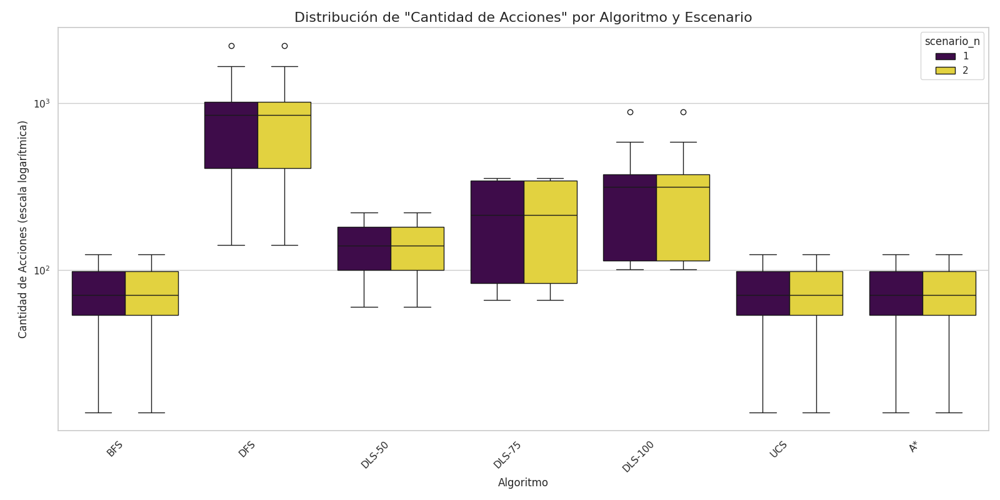
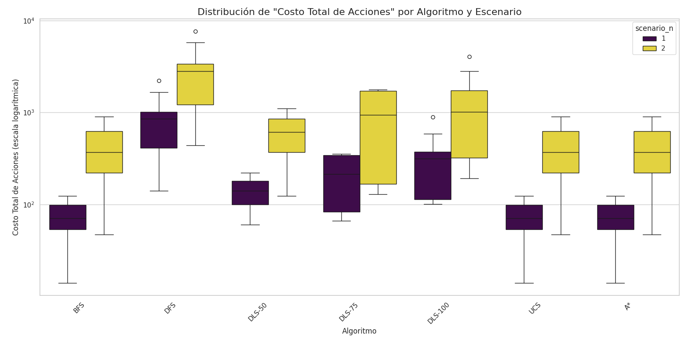
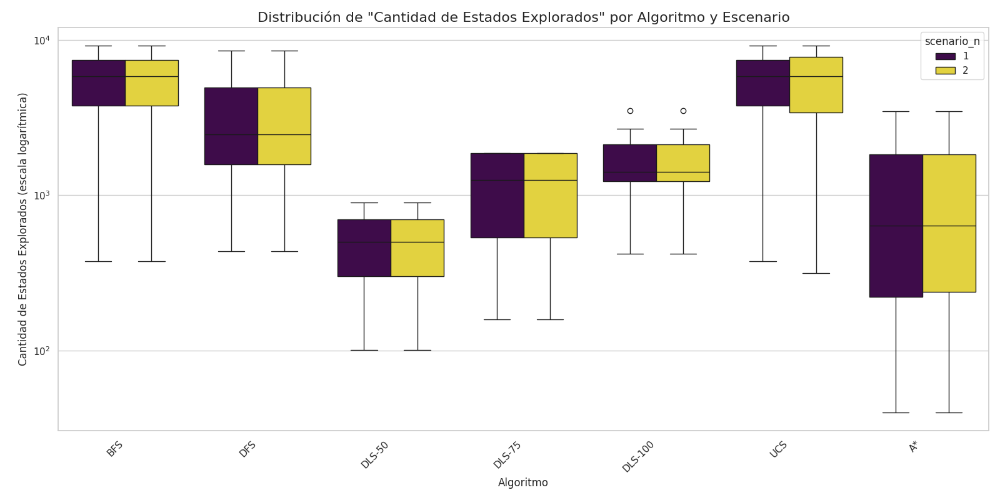
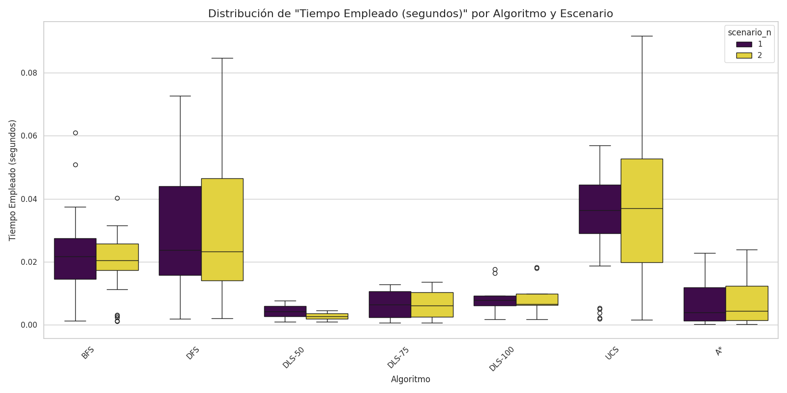

|Algoritmos|Escenario| media |desv. std.| media |desv. std.| media |desv. std.| media |desv. std.|
|----------|---------|-------|----------|-------|----------|-------|----------|-------|----------|
|A*        |1        |1000.03|    989.35|  72.90|     32.66|  72.90|     32.66|   0.01|      0.01|
|          |2        |1000.23|    988.98|  72.90|     32.66| 412.50|    248.61|   0.01|      0.01|
|BFS       |1        |5295.17|   2678.33|  72.90|     32.66|  72.90|     32.66|   0.02|      0.01|
|          |2        |5295.17|   2678.33|  72.90|     32.66| 412.50|    248.61|   0.02|      0.01|
|DFS       |1        |3277.00|   2378.34| 833.63|    522.82| 833.63|    522.82|   0.02|      0.01|
|          |2        |3277.00|   2378.34| 833.63|    522.82|2653.05|   1802.33|   0.02|      0.02|
|DLS-100   |1        |1683.11|    966.95| 337.22|    262.11| 337.22|    262.11|   0.01|      0.01|
|          |2        |1683.11|    966.95| 337.22|    262.11|1440.22|   1302.85|   0.01|      0.01|
|DLS-50    |1        | 499.00|    562.86| 140.50|    113.84| 140.50|    113.84|   0.00|      0.00|
|          |2        | 499.00|    562.86| 140.50|    113.84| 613.00|    692.96|   0.00|      0.00|
|DLS-75    |1        |1136.50|    864.98| 212.25|    156.02| 212.25|    156.02|   0.01|      0.00|
|          |2        |1136.50|    864.98| 212.25|    156.02| 948.00|    917.50|   0.01|      0.00|
|UCS       |1        |5295.17|   2678.33|  72.90|     32.66|  72.90|     32.66|   0.03|      0.02|
|          |2        |5264.77|   2903.77|  72.90|     32.66| 412.50|    248.61|   0.03|      0.02|

# Trabajo Práctico 3: Búsqueda no informada e informada

## Evaluación de desempeño de los algoritmos

## 1. Introducción

Se comparó el desempeño de distintos algoritmos de búsqueda. Fueron evaluados en dos escenarios distintos, en 30 mapas distintos.

En el primer escenario, cada acción tenía costo 1. Mientras que en el segundo, los movimientos horizontales tenían costo 1, y los verticales, 10.

Los algoritmos evaluados fueron:

    1. Búsqueda aleatoria
    2. Búsqueda por Anchura
    3. Búsqueda por Profundidad
    4. Búsqueda por Profundidad Limitada (límites = 50, 75 y 100)
    5. Búsqueda de Costo Uniforme
    6. Búsqueda A*

Los entornos utilizados tenían un tamaño de 100 x 100, con una probabilidad de 0.92 de que una celda sea transitable, y 0.08 de que sea un obstáculo. Al agente se le configuró una vida máxima de 1000 acciones.

## 2. Resultados

### 2.1 Cantidad de acciones por algoritmo y escenario

La siguiente figura muestra cuántas acciones tomaron los distintos algoritmos para llegar al objetivo, en cada tipo de escenario. Para cada algoritmo, solo se consideraron pruebas en las que se haya encontrado una solución dentro del límite de acciones máximo establecido.

La siguiente tabla muestra la media y la desviación estándar de la cantidad de acciones tomadas por algoritmos, por escenario.

|Algoritmos|Escenario| media |desv. std.|
|----------|---------|-------|----------|
|BFS       |1        |  72.90|     32.66|
|          |2        |  72.90|     32.66|
|DFS       |1        | 833.63|    522.82|
|          |2        | 833.63|    522.82|
|DLS-50    |1        | 140.50|    113.84|
|          |2        | 140.50|    113.84|
|DLS-100   |1        | 337.22|    262.11|
|          |2        | 337.22|    262.11|
|DLS-75    |1        | 212.25|    156.02|
|          |2        | 212.25|    156.02|
|UCS       |1        |  72.90|     32.66|
|          |2        |  72.90|     32.66|
|A*        |1        |  72.90|     32.66|
|          |2        |  72.90|     32.66|

### 2.2 Costo total de acciones por algoritmo y escenario

La siguiente figura muestra el costo total de las acciones que tomaron los distintos algoritmos para llegar al objetivo, en cada tipo de escenario. Solo se consideran pruebas en las que los algoritmos hayan encontrado una solución dentro del límite de acciones máximo establecido.

La siguiente tabla muestra la media y la desviación estándar de la cantidad de acciones tomadas por algoritmos, por escenario.

|Algoritmos|Escenario| media |desv. std.|
|----------|---------|-------|----------|
|A*        |1        |  72.90|     32.66|
|          |2        | 412.50|    248.61|
|BFS       |1        |  72.90|     32.66|
|          |2        | 412.50|    248.61|
|DFS       |1        | 833.63|    522.82|
|          |2        |2653.05|   1802.33|
|DLS-100   |1        | 337.22|    262.11|
|          |2        |1440.22|   1302.85|
|DLS-50    |1        | 140.50|    113.84|
|          |2        | 613.00|    692.96|
|DLS-75    |1        | 212.25|    156.02|
|          |2        | 948.00|    917.50|
|UCS       |1        |  72.90|     32.66|
|          |2        | 412.50|    248.61|

### 2.3 Cantidad de estados explorados por algoritmo y escenario

La siguiente figura muestra cuántas acciones tomaron los distintos algoritmos para llegar al objetivo, en cada tipo de escenario. Solo se consideran pruebas en las que los algoritmos hayan encontrado una solución dentro del límite de acciones máximo establecido.

La siguiente tabla muestra la media y la desviación estándar de la cantidad de acciones tomadas por algoritmos, por escenario.

|Algoritmos|Escenario| media |desv. std.|
|----------|---------|-------|----------|
|A*        |1        |1000.03|    989.35|
|          |2        |1000.23|    988.98|
|BFS       |1        |5295.17|   2678.33|
|          |2        |5295.17|   2678.33|
|DFS       |1        |3277.00|   2378.34|
|          |2        |3277.00|   2378.34|
|DLS-100   |1        |1683.11|    966.95|
|          |2        |1683.11|    966.95|
|DLS-50    |1        | 499.00|    562.86|
|          |2        | 499.00|    562.86|
|DLS-75    |1        |1136.50|    864.98|
|          |2        |1136.50|    864.98|
|UCS       |1        |5295.17|   2678.33|
|          |2        |5264.77|   2903.77|

### 2.4 Tiempo empleado por algoritmo y escenario

La siguiente figura muestra cuántas acciones tomaron los distintos algoritmos para llegar al objetivo, en cada tipo de escenario. Solo se consideran pruebas en las que los algoritmos hayan encontrado una solución dentro del límite de acciones máximo establecido.

La siguiente tabla muestra la media y la desviación estándar de la cantidad de acciones tomadas por algoritmos, por escenario.

|Algoritmos|Escenario| media |desv. std.|
|----------|---------|-------|----------|
|A*        |1        |   0.01|      0.01|
|          |2        |   0.01|      0.01|
|BFS       |1        |   0.02|      0.01|
|          |2        |   0.02|      0.01|
|DFS       |1        |   0.02|      0.01|
|          |2        |   0.02|      0.02|
|DLS-100   |1        |   0.01|      0.01|
|          |2        |   0.01|      0.01|
|DLS-50    |1        |   0.00|      0.00|
|          |2        |   0.00|      0.00|
|DLS-75    |1        |   0.01|      0.00|
|          |2        |   0.01|      0.00|
|UCS       |1        |   0.03|      0.02|
|          |2        |   0.03|      0.02|

## 3. Conclusión

asdasd