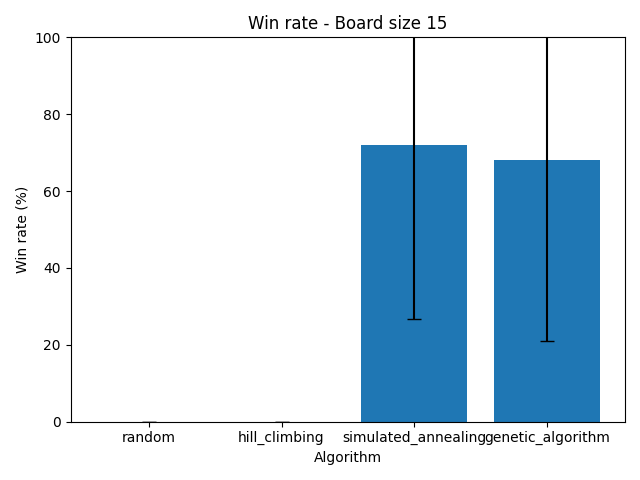
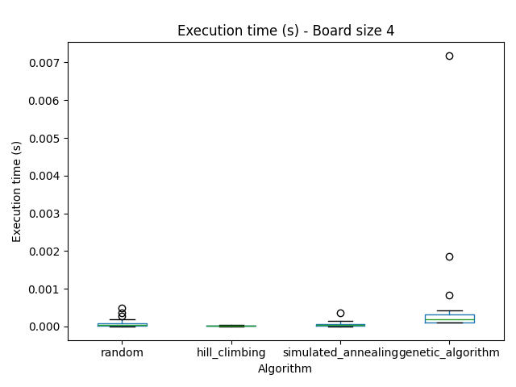
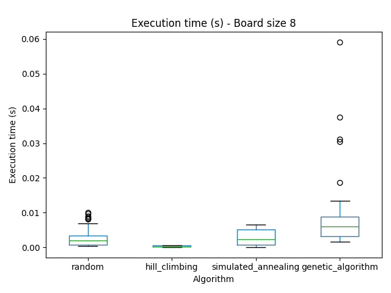

# Trabajo Práctico 4: Búsqueda local

## Evaluación de desempeño de los algoritmos

## 1. Introducción

Se comparó el desempeño de distintos algoritmos de búsqueda local para resolver el problema de las n reinas. Cada uno fue evaluado 50 veces para distintos tamaños de tablero (4, 8, 10, 12, 15).

Los algoritmos evaluados fueron:

1. Búsqueda aleatoria (Random)
2. Hill climbing (HC)
3. Simulated annealing (SA)
4. Algoritmo genético (GA)

Las soluciones fueron evaluadas utilizando una función de costo $H(e)$, que contabiliza la cantidad de pares de reinas amenazadas para una solución $e$.

### 1.1 Hill Climbing

En el caso de Hill Climbing, el algoritmo se detiene si no logra encontrar un vecino con menor valor de H que la solución actual.

### 1.2 Simulated Annealing

Para Simulated Annealing, se utilizó la siguiente función de schedule.

$$
\begin{aligned}
T_{k+1} &= T_k \times 0.99, \quad k > 0 \\
T_0     &= 1000
\end{aligned}
$$

o lo que es lo mismo:

$$ T(k) = T_0 \times 0.99^k $$

Los criterios de terminación utilizados fueron verificar si la temperatura era menor a 0.001, si se alcanzó cierto número máximo de estados explorados (10.000), o se llegó a una solución óptima (H=0). Los últimos dos criterios son comunes a todos los algoritmos.

### 1.3 Algoritmo Genético

El algoritmo genético utilizado presenta las siguientes características:

**Definición de los individuos de la población**

Para un problema de n reinas, cada individuo se representa como un arreglo de n enteros, donde cada entero se encuentra entre 0 y n-1. Por ejemplo, para el problema de 8 reinas, un individuo podría ser:

$$[6,5,4,2,3,7,1,0]$$

Cada posición del arreglo representa una columna del tablero. El número en tal posición indica la fila en la que se encuentra una reina. Siempre se garantiza que no haya números repetidos, es decir, nunca hay dos reinas en una misma fila. Los algoritmos solo deben descubrir como evitar que las reinas se amenacen entre sí de forma diagonal.

Esta estructura para especificar una solución es utilizada por todos los algoritmos.

**Estrategia de selección**

Se utilizó selección por torneos para la selección de los padres.

**Estrategia de reemplazo**

Se utilizó elitismo para realizar el reemplazo. Cada generación consiste del 10% de los mejores individuos de la anterior, el resto es reemplazado por los nuevos descendientes generados.

**Operadores**

Se utilizó PMX (Partially Mapped Crossover), ya que es útil para problemas de permutación como el de las n reinas.

También se utilizó un operador de mutación, que intercambia al azar dos genes, con una probabilidad del 20% para cada individuo.

**Criterios de terminación**

Se utilizaron los mismos que para los demás algoritmos (llegar a una solución óptima, o a un máximo permitido de estados explorados).

**Parámetros**

Tamaño de la población = 50

Cutoff de selección elitista = 10%

Probabilidad de mutación de individuo = 20%

Número de participantes en selección por torneo = 3

Máximo número de estados explorados = 10.000

## 2. Resultados

### 2.1 Tasa de obtención de solución óptima, por algoritmo y tamaño de tablero

La siguiente tabla muestra el porcentaje de pruebas en las que cada algoritmo llegó a una solución óptima (H=0), para cada tamaño de tablero.

| Algoritmo           | 4     | 8     | 10   | 12   | 15   |
| ------------------- | ----- | ----- | ---- | ---- | ---- |
| Random              | 100.0 | 100.0 | 94.0 | 26.0 | 0.0  |
| Hill Climbing       | 86.0  | 34.0  | 2.0  | 4.0  | 0.0  |
| Simulated Annealing | 100.0 | 100.0 | 92.0 | 86.0 | 72.0 |
| Algoritmo Genético  | 100.0 | 100.0 | 90.0 | 88.0 | 68.0 |

Los siguientes gráficos muestran estos resultados para algunos tamaños de tablero (ver anexo para los gráficos para todos los tamaños de tablero).

### Análisis

Se observa que tanto la búsqueda aleatoria, como simulated annealing y el algoritmo genético, logran un 100% de éxito para el tablero de tamaño 4. Hill climbing solo logra un 86%. Sin embargo, para mayores tamaños de tablero, el rendimiento de hill climbing cae rápidamente, llegando a 0% para el tablero más grande (15). Lo mismo ocurre con la búsqueda aleatoria, aunque su performance decae más lentamente.

Solamente simulated annealing y el algoritmo genético logran mantener una performance aceptable para el tablero de tamaño 15, con 72% y 68% respectivamente.

El mal rendimiento de hill climbing (incluso peor que la búsqueda aleatoria) se debe a que rápidamente encuentra un mínimo local del cual no puede escapar. Mientras que simulated annealing y el algoritmo genético pueden aceptar soluciones peores de forma temporal para ampliar el espacio de búsqueda.

### 2.2 Valor de H() promedio obtenido, por algoritmo y tamaño de tablero

La siguiente tabla muestra el valor de H() promedio obtenido por cada algoritmo, para cada tamaño de tablero.

| Algoritmo           | 4             | 8             | 10            | 12            | 15            |
| ------------------- | ------------- | ------------- | ------------- | ------------- | ------------- |
| Random              | 0.000 ± 0.000 | 0.000 ± 0.000 | 0.060 ± 0.240 | 0.740 ± 0.443 | 1.560 ± 0.501 |
| Hill Climbing       | 0.140 ± 0.351 | 1.120 ± 1.239 | 1.920 ± 1.426 | 2.580 ± 1.513 | 4.120 ± 2.154 |
| Simulated Annealing | 0.000 ± 0.000 | 0.000 ± 0.000 | 0.080 ± 0.274 | 0.140 ± 0.351 | 0.280 ± 0.454 |
| Algoritmo Genético  | 0.000 ± 0.000 | 0.000 ± 0.000 | 0.100 ± 0.303 | 0.120 ± 0.328 | 0.320 ± 0.471 |

Los siguientes gráficos muestran estos resultados para algunos tamaños de tablero (ver anexo para los gráficos para todos los tamaños de tablero).

### Análisis

Se observa que para el tablero de tamaño 4, todos los algoritmos, excepto hill climbing, consiguen un promedio de H() = 0. Hill climbing consigue 0.140 ± 0.351. Este último, aunque cercano a 0, es considerablemente malo, ya que el peor valor posible para este tamaño de tablero es 1. Esto coincide con los resultados previos, donde hill climbing fue el único algoritmo que no pudo resolver el 100% de las pruebas para este tamaño de tablero.

Para tableros más grandes, el rendimiento va empeorando en todos los algoritmos (H aumenta). Solo simulated annealing y el algoritmo genético logran un mejor valor de H promedio cercano a 0, mientras que el de hill climbing aumenta a 4.120 ± 2.154, y el de la búsqueda aleatoria a 1.560 ± 0.501 para el tablero más grande. Esto también coincide con los resultados previos.

### 2.3 Tiempo de ejecución por algoritmo y tamaño de tablero

La siguiente tabla muestra el tiempo de ejecución promedio para cada algoritmo, para cada tamaño de tablero.

| Algoritmo           | 4             | 8             | 10            | 12            | 15            |
| ------------------- | ------------- | ------------- | ------------- | ------------- | ------------- |
| Random              | 0.000 ± 0.000 | 0.003 ± 0.003 | 0.025 ± 0.022 | 0.081 ± 0.030 | 0.134 ± 0.002 |
| Hill Climbing       | 0.000 ± 0.000 | 0.000 ± 0.000 | 0.001 ± 0.000 | 0.001 ± 0.000 | 0.002 ± 0.000 |
| Simulated Annealing | 0.000 ± 0.000 | 0.003 ± 0.002 | 0.011 ± 0.004 | 0.015 ± 0.004 | 0.025 ± 0.005 |
| Algoritmo Genético  | 0.000 ± 0.001 | 0.008 ± 0.010 | 0.091 ± 0.149 | 0.178 ± 0.214 | 0.534 ± 0.394 |

Los siguientes gráficos muestran estos resultados para algunos tamaños de tablero (ver anexo para los gráficos para todos los tamaños de tablero).

### Análisis

Se observa que para el tablero de tamaño 4, todos los algoritmos convergen casi instantáneamente, aunque en el caso del algoritmo genético, hay un poco más de variabilidad.

A medida que aumenta el tamaño del tablero, el tiempo de ejecución de hill climbing se mantiene casi constante, cercano a 0, ya que no explora mucho y se queda estancado en un mínimo local, encontrando soluciones poco óptimas.

Simulated annealing no aumenta considerablemente su tiempo de ejecución, llegando solo a 15 ms para el tablero más grande. Esto se debe al criterio de terminación utilizado, lo cual pone un límite fijo al tiempo de exploración.

En comparación, los algoritmos de búsqueda aleatoria y el genético tienen criterios de terminación laxos (solución óptima, o límite máximo de estados explorados). Por lo tanto, su tiempo de ejecución continúa aumentando considerablemente a medida que aumenta el tamaño del tablero. En el caso del algoritmo genético, como es más costoso computacionalmente por cada estado explorado, el tiempo es considerablemente mayor que el de la búsqueda aleatoria, aunque en general, en los peores casos, llegan a explorar la misma cantidad de estados, como se verá en la siguiente sección.

Pero como el algoritmo genético es más óptimo a la hora de encontrar soluciones, hay más casos que en la búsqueda aleatoria donde se llega a una solución óptima más rápidamente, aumentando la variabilidad en el tiempo de ejecución, y logrando tiempos de ejecución menores que la búsqueda aleatoria para esos mejores casos. En promedio, sin embargo, la búsqueda aleatoria es más rápida, aunque es menos probable que encuentre la solución óptima, como se vio anteriormente.

### 2.4 Cantidad de estados explorados por algoritmo y tamaño de tablero

La siguiente tabla muestra la cantidad de estados explorados en promedio para cada algoritmo, para cada tamaño de tablero.

| Algoritmo           | 4               | 8                 | 10                  | 12                  | 15                  |
| ------------------- | --------------- | ----------------- | ------------------- | ------------------- | ------------------- |
| Random              | 10.340 ± 12.280 | 477.620 ± 405.214 | 3457.220 ± 2989.338 | 8307.540 ± 3143.780 | 10000.000 ± 0.000   |
| Hill Climbing       | 9.040 ± 3.758   | 54.760 ± 7.673    | 91.000 ± 0.000      | 131.680 ± 9.334     | 211.000 ± 0.000     |
| Simulated Annealing | 12.560 ± 13.455 | 336.440 ± 256.361 | 880.980 ± 296.986   | 987.320 ± 242.204   | 1121.040 ± 206.326  |
| Algoritmo Genético  | 52.000 ± 9.897  | 322.000 ± 331.533 | 1895.000 ± 3019.178 | 2781.000 ± 3229.107 | 5425.000 ± 3833.383 |

Los siguientes gráficos muestran estos resultados para algunos tamaños de tablero (ver anexo para los gráficos para todos los tamaños de tablero).

### Análisis

Se observa que para el tablero de tamaño 4, todos los algoritmos recorren pocos estados. El caso del algoritmo genético es el peor, ya que necesariamente recorre un múltiplo de su tamaño de población de estados (en el gráfico se observa que en todas las pruebas se obtiene 50 o 100).

A medida que aumenta el tamaño del tablero, la cantidad de estados explorados de hill climbing se mantiene baja, ya que no explora mucho y se queda estancado en un mínimo local, encontrando soluciones poco óptimas.

Simulated annealing es el algoritmo para el cual menos aumenta la cantidad de estados explorados, mientras que aún así logra encontrar la mayor tasa de soluciones óptimas (hill climbing explora menos estados, pero no encuentra soluciones óptimas para tableros grandes). Esto se debe al criterio de terminación utilizado, lo cual pone un límite fijo a la cantidad de estados explorados.

En comparación, los algoritmos de búsqueda aleatoria y el genético tienen criterios de terminación laxos (solución óptima, o límite máximo de estados explorados). Por lo tanto, la cantidad de estados que exploran continúa aumentando considerablemente a medida que aumenta el tamaño del tablero.

En el caso del algoritmo genético, como es más eficiente para encontrar soluciones que la búsqueda aleatoria, en promedio explora menos estado para explorar soluciones óptimas.

En el caso de la búsqueda aleatoria, para el tablero de mayor tamaño, nunca encuentra una solución óptima, por lo que siempre explora la cantidad máxima de estados permitidos (10.000). Para  este mismo tablero, el algoritmo genético en algunos casos hace lo mismo, pero en la mayoría de los casos, encuentra la solución óptima en menor cantidad de estados, aunque con una gran variabilidad.

En general, es simulated annealing el que menos estados explora y a la vez es capaz de encontrar una gran tasa de soluciones óptimas.

### 2.5 Evolución de H por iteración, por algoritmo

El siguiente gráfico muestra la evolución del valor de H() en cada iteración para cada algoritmo. Se muestran solo los resultados para el tablero de tamaño 15, ya que es el que permite apreciar mejor la convergencia de los distintos algoritmos. Para otros tamaños se obtuvieron resultados similares (ver anexo), excepto para el tablero más pequeño ya que todos convergen demasiado rápido.

### Análisis

Vemos que, en coincidencia con los resultados previos, solo los algoritmos simulated annealing y el algoritmo genético llegan a valores cercanos a 0 para H() en este tablero. El algoritmo de hill climbing nunca logra converger, ya que rápidamente encuentra un mínimo local. El algoritmo de búsqueda aleatoria converge muy lentamente, hasta llegar al máximo de estados permitidos, y no logra un valor de H cercano a 0, aunque mejor que el de hill climbing.

En un primer análisis, pareciera que el algoritmo genético converge más rápidamente, pero esto no es así. Las gráficas muestran H en función de las iteraciones transcurridas, pero una iteración no tiene el mismo costo computacional para distintos algoritmos. Una iteración del algoritmo de búsqueda aleatoria o de simulated annealing, requiere muy poca computación, cada uno explorando un único estado por iteración.

En cambio, el algoritmo genético realiza muchas computaciones en cada iteración. En cada una, realiza la selección, cruzamiento, generación de hijos y reemplazo de toda la población. Cada iteración implica explorar un estado por cada individuo de la población (50).

Lo correcto hubiese sido medir la convergencia en función de la cantidad de estados explorados, o en función del tiempo.

Sin embargo, la comparación entre la búsqueda aleatoria y simulated annealing es relativamente justa, ya que en ambos una iteración corresponde a un estado explorado. En este caso, si podemos concluir que simulated annealing converge más rápidamente que la búsqueda aleatoria. Esto ocurre cuando la temperatura llega a un nivel particularmente bajo, forzando la convergencia.

## 3. Conclusión

Se puede concluir que Simulated Annealing es, según todas las métricas analizadas, la mejor opción para resolver el problema de las n reinas, especialmente a medida que aumenta el tamaño del tablero, mientras que hill climbing es la peor. El algoritmo genético es casi tan capaz como simulated annealing pero requiere de un costo computacional considerablemente mayor. La mala performance de Hill Climbing se debe a que encuentra mínimos locales muy rápidamente, de los cuáles le es imposible salir, llegando a soluciones muy poco óptimas (H muy elevado), mientras que Simulated Annealing y el Algoritmo Genético permiten explorar soluciones peores a la mejor ya encontrada, permitiendo así explorar una mayor parte del espacio de soluciones. 

## 4. Anexo

Comparación de tasa de obtención de solución óptima por algoritmo, para cada tamaño de tablero.

Comparación de valor de H() promedio obtenido por algoritmo, para cada tamaño de tablero.

Comparación de tiempo de ejecución por algoritmo, para cada tamaño de tablero.

Comparación de cantidad de estados explorados por algoritmo, para cada tamaño de tablero.

Comparación de mejor H() en función de número de iteraciones por algoritmo, para cada tamaño de tablero.

