# Trabajo Práctico 5: Satisfacción de restricciones

## Preguntas

### 1. Describir en detalle una formulación CSP para el Sudoku.

Una posible formulación es la siguiente.

**Variables:** Suponiendo que el Sudoku es de 9×9, tenemos 81 celdas. Cada celda es una variable $X_{i,j}$.

**Dominios:** Los dominios de estas variables son los enteros del 1 al 9. En las celdas con valores iniciales, su dominio se reduce a su valor inicial.

**Restricciones:**

1. Todas las variables en una misma fila (mismo $i$) deben tener valores distintos.

2. Todas las variables en una misma columna (mismo $j$) deben tener valores distintos.

3. Todas las variables en una misma caja de 3×3 (hay 9 cajas, una central y 8 en los bordes del Sudoku), deben tener valores distintos.

**Grafo de restricciones**

Estas variables y sus restricciones pueden representarse como un grafo de restricciones, donde las variables son nodos, y las restricciones aristas entre estos nodos.

La siguiente imagen muestra cómo serían las conexiones de un sólo nodo (no se pueden mostrar las de todos los nodos, ya que son demasiadas).

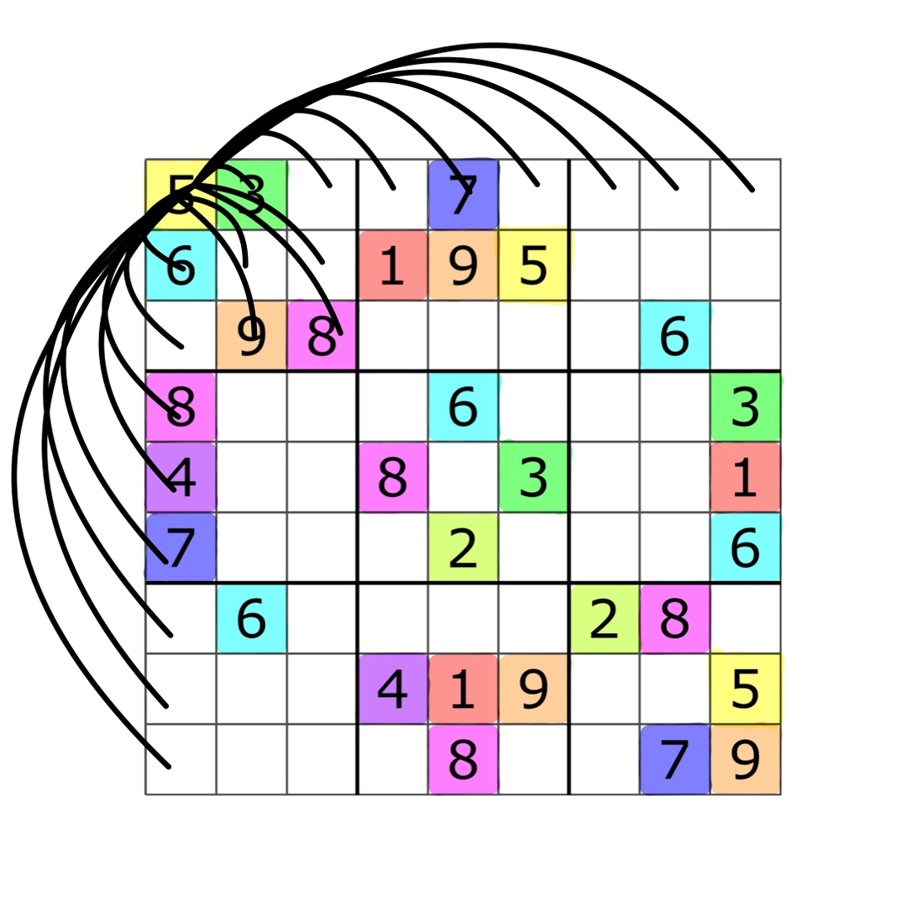

Cada celda está conectada a todas las de su misma fila, misma columna, y misma caja (eliminando duplicados), dando un total de 20 conexiones por nodo, y un total de $81 \times 20 \div 2= 810$ aristas para todo el Sudoku.


### 2. Utilizar el algoritmo AC-3 para demostrar que la arco consistencia puede detectar la inconsistencia de la asignación parcial WA=red, V=blue para el problema de colorear el mapa de Australia.

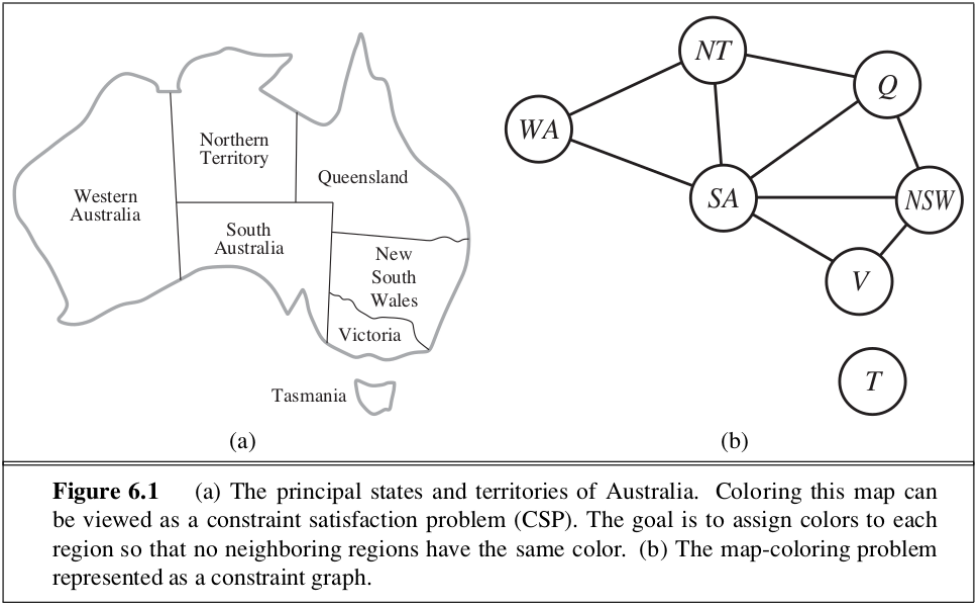
(Figura 6.1 AIMA 3ra edicion)

Tenemos los arcos dirigidos (AC-3 trabaja con arcos dirigidos):


```
(WA,NT),(NT,WA), (WA,SA),(SA,WA),

(NT, Q),(Q, NT), (NT,SA),(SA,NT),

(Q,NSW),(NSW,Q), (Q, SA),(SA, Q),

(NSW,V),(V,NSW), (NSW,SA),(SA,NSW),

(V, SA),(SA, V),
```


En un primer momento, se asignan las variables WA y V.

$$D_{WA} = \{red\}$$
$$D_{V} = \{blue\}$$

Añadimos los arcos conectados a V y WA a la cola

```
Q = {(NT, WA), (SA, WA), (SA, V), (NSW, V)}
```

Ejecutamos el algoritmo

|   Iter | Arco     | Cola antes                                                                                                                                                              | WA    | NT              | SA              | Q               | NSW             | V     | T               | Resultado                                             |
|-------:|:---------|:------------------------------------------------------------------------------------------------------------------------------------------------------------------------|:------|:----------------|:----------------|:----------------|:----------------|:------|:----------------|:------------------------------------------------------|
|      1 | (NT,WA)  | [('SA', 'WA'), ('SA', 'V'), ('NSW', 'V')]                                                                                                                               | {'r'} | {'b', 'g', 'r'} | {'b', 'g', 'r'} | {'b', 'g', 'r'} | {'b', 'g', 'r'} | {'b'} | {'b', 'g', 'r'} | Eliminado {'r'} de NT                                 |
|      2 | (SA,WA)  | [('SA', 'V'), ('NSW', 'V'), ('SA', 'NT'), ('Q', 'NT')]                                                                                                                  | {'r'} | {'b', 'g'}      | {'b', 'g', 'r'} | {'b', 'g', 'r'} | {'b', 'g', 'r'} | {'b'} | {'b', 'g', 'r'} | Eliminado {'r'} de SA                                 |
|      3 | (SA,V)   | [('NSW', 'V'), ('SA', 'NT'), ('Q', 'NT'), ('NT', 'SA'), ('Q', 'SA'), ('NSW', 'SA'), ('V', 'SA')]                                                                        | {'r'} | {'b', 'g'}      | {'b', 'g'}      | {'b', 'g', 'r'} | {'b', 'g', 'r'} | {'b'} | {'b', 'g', 'r'} | Eliminado {'b'} de SA                                 |
|      4 | (NSW,V)  | [('SA', 'NT'), ('Q', 'NT'), ('NT', 'SA'), ('Q', 'SA'), ('NSW', 'SA'), ('V', 'SA'), ('WA', 'SA'), ('NT', 'SA'), ('Q', 'SA'), ('NSW', 'SA')]                              | {'r'} | {'b', 'g'}      | {'g'}           | {'b', 'g', 'r'} | {'b', 'g', 'r'} | {'b'} | {'b', 'g', 'r'} | Eliminado {'b'} de NSW                                |
|      5 | (SA,NT)  | [('Q', 'NT'), ('NT', 'SA'), ('Q', 'SA'), ('NSW', 'SA'), ('V', 'SA'), ('WA', 'SA'), ('NT', 'SA'), ('Q', 'SA'), ('NSW', 'SA'), ('Q', 'NSW'), ('SA', 'NSW')]               | {'r'} | {'b', 'g'}      | {'g'}           | {'b', 'g', 'r'} | {'g', 'r'}      | {'b'} | {'b', 'g', 'r'} | Sin cambios                                           |
|      6 | (Q,NT)   | [('NT', 'SA'), ('Q', 'SA'), ('NSW', 'SA'), ('V', 'SA'), ('WA', 'SA'), ('NT', 'SA'), ('Q', 'SA'), ('NSW', 'SA'), ('Q', 'NSW'), ('SA', 'NSW')]                            | {'r'} | {'b', 'g'}      | {'g'}           | {'b', 'g', 'r'} | {'g', 'r'}      | {'b'} | {'b', 'g', 'r'} | Sin cambios                                           |
|      7 | (NT,SA)  | [('Q', 'SA'), ('NSW', 'SA'), ('V', 'SA'), ('WA', 'SA'), ('NT', 'SA'), ('Q', 'SA'), ('NSW', 'SA'), ('Q', 'NSW'), ('SA', 'NSW')]                                          | {'r'} | {'b', 'g'}      | {'g'}           | {'b', 'g', 'r'} | {'g', 'r'}      | {'b'} | {'b', 'g', 'r'} | Eliminado {'g'} de NT                                 |
|      8 | (Q,SA)   | [('NSW', 'SA'), ('V', 'SA'), ('WA', 'SA'), ('NT', 'SA'), ('Q', 'SA'), ('NSW', 'SA'), ('Q', 'NSW'), ('SA', 'NSW'), ('WA', 'NT'), ('Q', 'NT')]                            | {'r'} | {'b'}           | {'g'}           | {'b', 'g', 'r'} | {'g', 'r'}      | {'b'} | {'b', 'g', 'r'} | Eliminado {'g'} de Q                                  |
|      9 | (NSW,SA) | [('V', 'SA'), ('WA', 'SA'), ('NT', 'SA'), ('Q', 'SA'), ('NSW', 'SA'), ('Q', 'NSW'), ('SA', 'NSW'), ('WA', 'NT'), ('Q', 'NT'), ('NT', 'Q'), ('NSW', 'Q')]                | {'r'} | {'b'}           | {'g'}           | {'b', 'r'}      | {'g', 'r'}      | {'b'} | {'b', 'g', 'r'} | Eliminado {'g'} de NSW                                |
|     10 | (V,SA)   | [('WA', 'SA'), ('NT', 'SA'), ('Q', 'SA'), ('NSW', 'SA'), ('Q', 'NSW'), ('SA', 'NSW'), ('WA', 'NT'), ('Q', 'NT'), ('NT', 'Q'), ('NSW', 'Q'), ('Q', 'NSW'), ('V', 'NSW')] | {'r'} | {'b'}           | {'g'}           | {'b', 'r'}      | {'r'}           | {'b'} | {'b', 'g', 'r'} | Sin cambios                                           |
|     11 | (WA,SA)  | [('NT', 'SA'), ('Q', 'SA'), ('NSW', 'SA'), ('Q', 'NSW'), ('SA', 'NSW'), ('WA', 'NT'), ('Q', 'NT'), ('NT', 'Q'), ('NSW', 'Q'), ('Q', 'NSW'), ('V', 'NSW')]               | {'r'} | {'b'}           | {'g'}           | {'b', 'r'}      | {'r'}           | {'b'} | {'b', 'g', 'r'} | Sin cambios                                           |
|     12 | (NT,SA)  | [('Q', 'SA'), ('NSW', 'SA'), ('Q', 'NSW'), ('SA', 'NSW'), ('WA', 'NT'), ('Q', 'NT'), ('NT', 'Q'), ('NSW', 'Q'), ('Q', 'NSW'), ('V', 'NSW')]                             | {'r'} | {'b'}           | {'g'}           | {'b', 'r'}      | {'r'}           | {'b'} | {'b', 'g', 'r'} | Sin cambios                                           |
|     13 | (Q,SA)   | [('NSW', 'SA'), ('Q', 'NSW'), ('SA', 'NSW'), ('WA', 'NT'), ('Q', 'NT'), ('NT', 'Q'), ('NSW', 'Q'), ('Q', 'NSW'), ('V', 'NSW')]                                          | {'r'} | {'b'}           | {'g'}           | {'b', 'r'}      | {'r'}           | {'b'} | {'b', 'g', 'r'} | Sin cambios                                           |
|     14 | (NSW,SA) | [('Q', 'NSW'), ('SA', 'NSW'), ('WA', 'NT'), ('Q', 'NT'), ('NT', 'Q'), ('NSW', 'Q'), ('Q', 'NSW'), ('V', 'NSW')]                                                         | {'r'} | {'b'}           | {'g'}           | {'b', 'r'}      | {'r'}           | {'b'} | {'b', 'g', 'r'} | Sin cambios                                           |
|     15 | (Q,NSW)  | [('SA', 'NSW'), ('WA', 'NT'), ('Q', 'NT'), ('NT', 'Q'), ('NSW', 'Q'), ('Q', 'NSW'), ('V', 'NSW')]                                                                       | {'r'} | {'b'}           | {'g'}           | {'b', 'r'}      | {'r'}           | {'b'} | {'b', 'g', 'r'} | Eliminado {'r'} de Q                                  |
|     16 | (SA,NSW) | [('WA', 'NT'), ('Q', 'NT'), ('NT', 'Q'), ('NSW', 'Q'), ('Q', 'NSW'), ('V', 'NSW'), ('NT', 'Q'), ('SA', 'Q')]                                                            | {'r'} | {'b'}           | {'g'}           | {'b'}           | {'r'}           | {'b'} | {'b', 'g', 'r'} | Sin cambios                                           |
|     17 | (WA,NT)  | [('Q', 'NT'), ('NT', 'Q'), ('NSW', 'Q'), ('Q', 'NSW'), ('V', 'NSW'), ('NT', 'Q'), ('SA', 'Q')]                                                                          | {'r'} | {'b'}           | {'g'}           | {'b'}           | {'r'}           | {'b'} | {'b', 'g', 'r'} | Sin cambios                                           |
|     18 | (Q,NT)   | [('NT', 'Q'), ('NSW', 'Q'), ('Q', 'NSW'), ('V', 'NSW'), ('NT', 'Q'), ('SA', 'Q')]                                                                                       | {'r'} | {'b'}           | {'g'}           | {'b'}           | {'r'}           | {'b'} | {'b', 'g', 'r'} | Eliminado {'b'} de Q → Dominio vacío (inconsistencia) |


### 3. ¿Cuál es la complejidad en el peor caso cuando se ejecuta AC-3 en un árbol estructurado CSP? (i.e. cuando el grafo de restricciones forma un árbol: cualquiera dos variables están relacionadas por a lo sumo un camino).

En un árbol, existe un único camino entre cualquier par de vértices (no hay ciclos). Además, un árbol tiene n - 1 aristas, donde n es la cantidad de vértices.

Si comenzamos la revisión desde un nodo en particular, como no hay ciclos, nunca volveremos a revisar ese nodo. En el peor caso, revisaremos todos los arcos del árbol, lo cuál es $O(n)$, ya que v = n - 1.

En cada revisión de un arco, hay que revisar que para todos los elementos del dominio de un nodo existe uno en el otro nodo que cumpla la restricción. Entonces cada revisión tiene un costo de $O(d^2)$, donde d es el tamaño del dominio más grande del problema.

Entonces, la complejidad total es de $O(nd^2)$.


## Evaluación de desempeño de los algoritmos


## 1. Introducción

Se comparó el desempeño de distintos algoritmos de búsqueda local para resolver el problema de las n reinas. Cada uno fue evaluado 50 veces para distintos tamaños de tablero (4, 8, 10, 12, 15).

Los algoritmos evaluados fueron:

1. Búsqueda aleatoria (Random)
2. Hill climbing (HC)
3. Simulated annealing (SA)
4. Algoritmo genético (GA)
5. CSP - Backtracking (CSP-BT)
6. CSP - Forward Checking (CSP-FC)

Las soluciones fueron evaluadas utilizando una función de costo $H(e)$, que contabiliza la cantidad de pares de reinas amenazadas para una solución $e$.


## 2. Resultados

### 2.1 Tasa de obtención de solución óptima, por algoritmo y tamaño de tablero

La siguiente tabla muestra el porcentaje de pruebas en las que cada algoritmo llegó a una solución óptima (H=0), para cada tamaño de tablero.

| algorithm_name   |   4 |   8 |   10 |   12 |   15 |
|:-----------------|----:|----:|-----:|-----:|-----:|
| Random           | 100 | 100 |   94 |   26 |    0 |
| HC               |  86 |  34 |    2 |    4 |    0 |
| SA               | 100 | 100 |   92 |   86 |   72 |
| GA               | 100 | 100 |   90 |   88 |   68 |
| CSP-BT           | 100 | 100 |  100 |  100 |  100 |
| CSP-FC           | 100 | 100 |  100 |  100 |  100 |

Los siguientes gráficos muestran estos resultados para algunos tamaños de tablero (ver anexo para los gráficos para todos los tamaños de tablero).

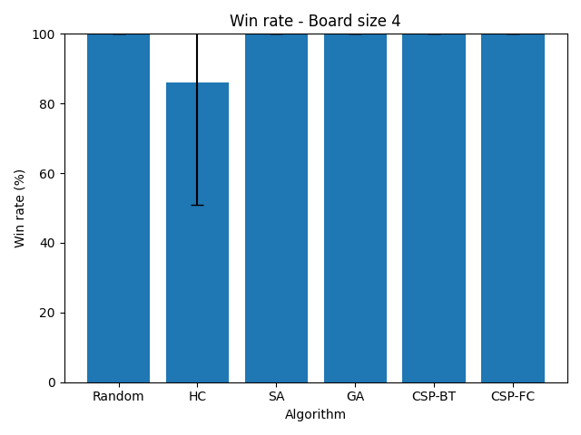

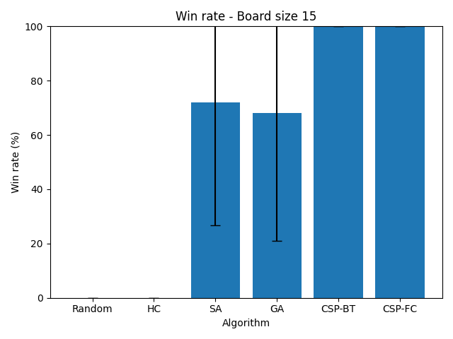

### Análisis

Podemos ver que ambas versiones de CSP logran obtener la solución óptima en todas las pruebas, independientemente del tamaño del tablero, a diferencia de los algoritmos analizados en el TP 4.

Esto se debe a que CSP garantiza encontrar una solución si la misma existe (siempre que no se supere el límite de estados máximo, lo cuál no ocurrió nunca), y el problema de las n reinas siempre tiene solución para tableros de tamaño mayor a 3.


### 2.2 Valor de H() promedio obtenido, por algoritmo y tamaño de tablero

La siguiente tabla muestra el valor de H() promedio obtenido por cada algoritmo, para cada tamaño de tablero.

| algorithm_name   | 4             | 8             | 10            | 12            | 15            |
|:-----------------|:--------------|:--------------|:--------------|:--------------|:--------------|
| Random           | 0.000 ± 0.000 | 0.000 ± 0.000 | 0.060 ± 0.240 | 0.740 ± 0.443 | 1.560 ± 0.501 |
| HC               | 0.140 ± 0.351 | 1.120 ± 1.239 | 1.920 ± 1.426 | 2.580 ± 1.513 | 4.120 ± 2.154 |
| SA               | 0.000 ± 0.000 | 0.000 ± 0.000 | 0.080 ± 0.274 | 0.140 ± 0.351 | 0.280 ± 0.454 |
| GA               | 0.000 ± 0.000 | 0.000 ± 0.000 | 0.100 ± 0.303 | 0.120 ± 0.328 | 0.320 ± 0.471 |
| CSP-BT           | 0.000 ± 0.000 | 0.000 ± 0.000 | 0.000 ± 0.000 | 0.000 ± 0.000 | 0.000 ± 0.000 |
| CSP-FC           | 0.000 ± 0.000 | 0.000 ± 0.000 | 0.000 ± 0.000 | 0.000 ± 0.000 | 0.000 ± 0.000 |

Los siguientes gráficos muestran estos resultados para algunos tamaños de tablero (ver anexo para los gráficos para todos los tamaños de tablero).

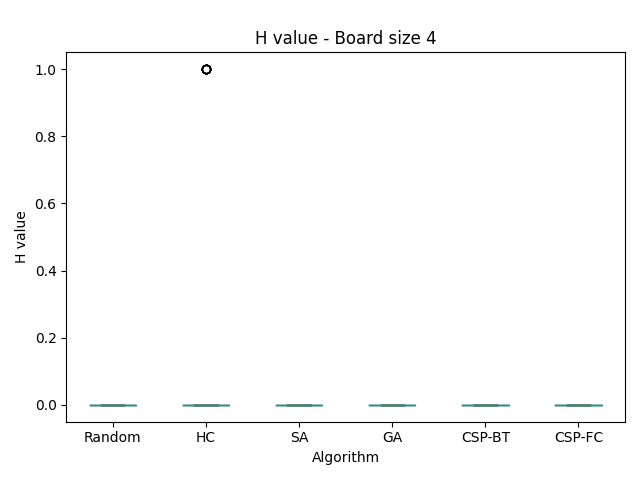
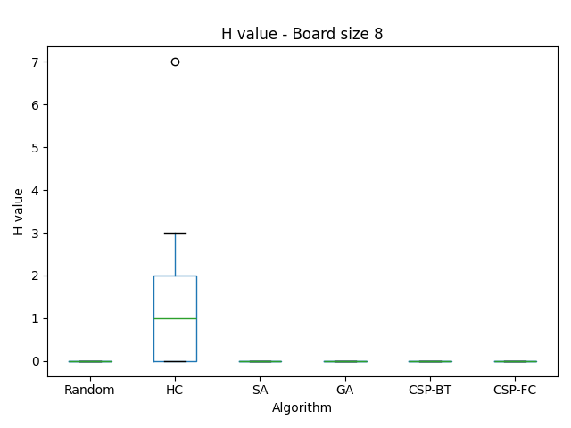
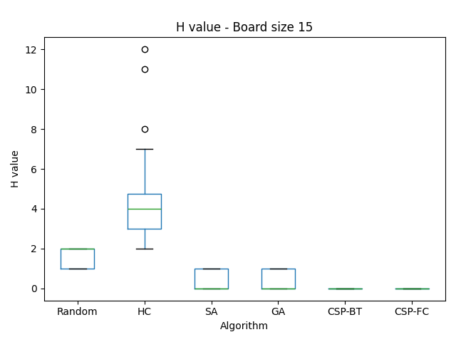

### Análisis

En coincidencia con el resultado anterior, vemos que ambas implementaciones de CSP logran un valor de H() = 0 en todas las pruebas, es decir, lograron encontrar una solución óptima en cada prueba.


### 2.3 Tiempo de ejecución por algoritmo y tamaño de tablero

La siguiente tabla muestra el tiempo de ejecución promedio para cada algoritmo, para cada tamaño de tablero.

| algorithm_name   | 4             | 8             | 10            | 12            | 15            |
|:-----------------|:--------------|:--------------|:--------------|:--------------|:--------------|
| Random           | 0.000 ± 0.000 | 0.003 ± 0.003 | 0.029 ± 0.026 | 0.108 ± 0.051 | 0.175 ± 0.033 |
| HC               | 0.000 ± 0.000 | 0.000 ± 0.000 | 0.001 ± 0.000 | 0.001 ± 0.000 | 0.003 ± 0.001 |
| SA               | 0.000 ± 0.000 | 0.005 ± 0.004 | 0.016 ± 0.007 | 0.020 ± 0.006 | 0.037 ± 0.012 |
| GA               | 0.000 ± 0.000 | 0.011 ± 0.013 | 0.099 ± 0.165 | 0.187 ± 0.222 | 0.505 ± 0.353 |
| CSP-BT           | 0.000 ± 0.000 | 0.000 ± 0.001 | 0.001 ± 0.000 | 0.001 ± 0.001 | 0.002 ± 0.003 |
| CSP-FC           | 0.000 ± 0.000 | 0.000 ± 0.000 | 0.000 ± 0.000 | 0.000 ± 0.000 | 0.001 ± 0.001 |

Los siguientes gráficos muestran estos resultados para algunos tamaños de tablero (ver anexo para los gráficos para todos los tamaños de tablero).

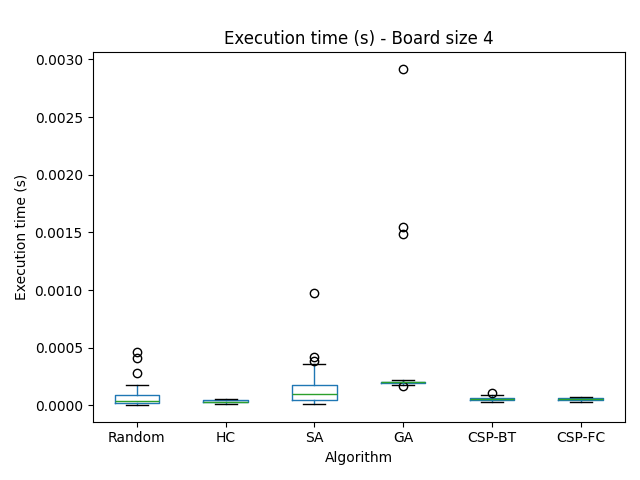
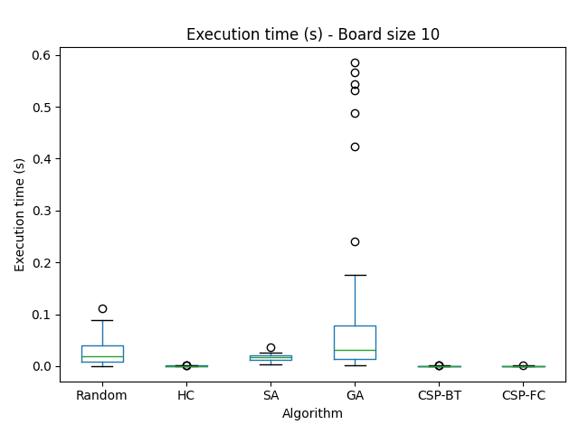
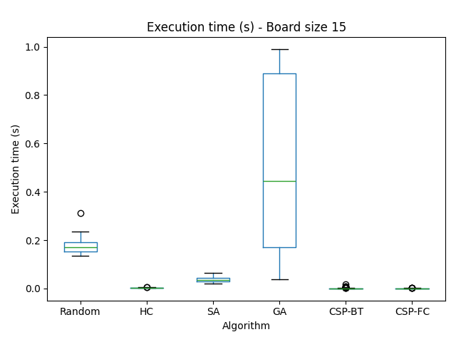

### Análisis

En todas las pruebas, ambas implementaciones de CSP no solo hallan la solución óptima, sino que lo hacen en 1 ms o menos. Esto es un orden de magnitud mejor que SA, y varios órdenes de magnitud mejor que GA, cuando éstos ni siquiera llegan a un 75% de soluciones óptimas.

La implementación de CSP-FC es significativamente más rápida que CSP-BT, debido al recorte de ramas que permite la técnica de forward checking. De todas maneras, para este problema, ambas implementaciones resultan muy rápidas.


### 2.4 Cantidad de estados explorados por algoritmo y tamaño de tablero

La siguiente tabla muestra la cantidad de estados explorados en promedio para cada algoritmo, para cada tamaño de tablero.

| algorithm_name   | 4               | 8                 | 10                  | 12                  | 15                  |
|:-----------------|:----------------|:------------------|:--------------------|:--------------------|:--------------------|
| Random           | 10.340 ± 12.280 | 477.620 ± 405.214 | 3457.220 ± 2989.338 | 8307.540 ± 3143.780 | 10000.000 ± 0.000   |
| HC               | 9.040 ± 3.758   | 54.760 ± 7.673    | 91.000 ± 0.000      | 131.680 ± 9.334     | 211.000 ± 0.000     |
| SA               | 12.560 ± 13.455 | 336.440 ± 256.361 | 880.980 ± 296.986   | 987.320 ± 242.204   | 1121.040 ± 206.326  |
| GA               | 52.000 ± 9.897  | 322.000 ± 331.533 | 1895.000 ± 3019.178 | 2781.000 ± 3229.107 | 5425.000 ± 3833.383 |
| CSP-BT           | 10.280 ± 5.739  | 47.680 ± 49.584   | 92.240 ± 81.967     | 167.960 ± 297.433   | 296.280 ± 451.159   |
| CSP-FC           | 6.200 ± 1.278   | 17.700 ± 10.634   | 42.420 ± 33.905     | 46.240 ± 57.596     | 63.740 ± 61.473     |

Los siguientes gráficos muestran estos resultados para algunos tamaños de tablero (ver anexo para los gráficos para todos los tamaños de tablero).

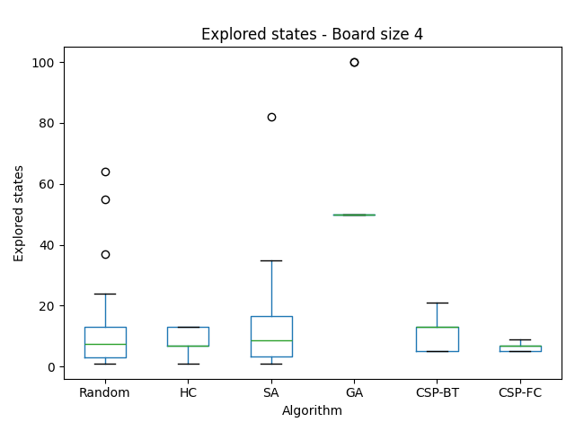
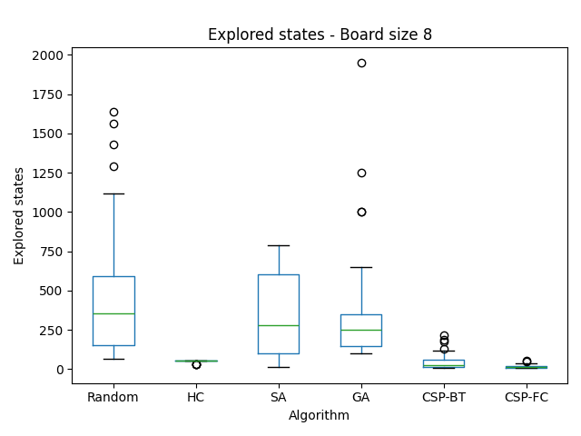
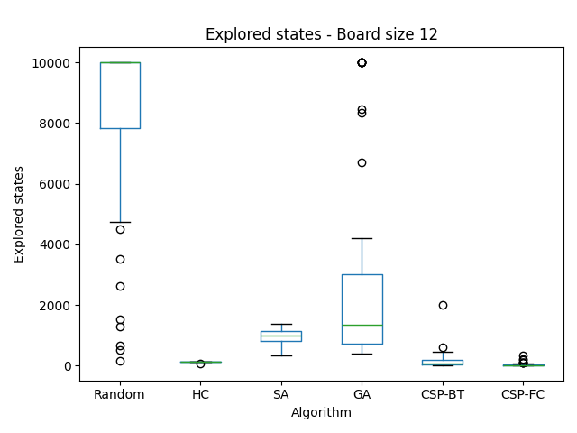
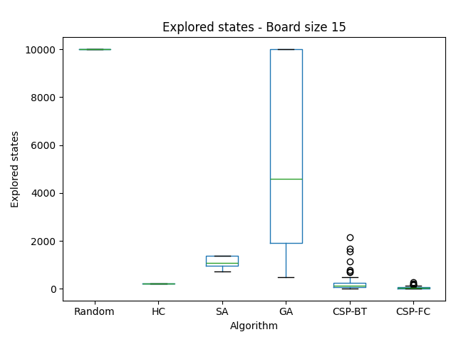

### Análisis

Se observa que ambas implementaciones de CSP son las que menos estados exploran en comparación a los demás algoritmos del TP 4. Esta diferencia se hace aún mayor a medida que aumenta el tamaño del tablero, a pesar de que ambas versiones de CSP son las únicas que logran resolver todas las pruebas para el tamaño más grande tablero.

La implementación de CSP-FC recorre muchos menos nodos que CSP-BT, debido al recorte de ramas que permite la técnica de forward checking. De todas maneras, para este problema, ambas implementaciones son muy eficientes y recorren pocos estados.


## 3. Conclusión

Se puede concluir que CSP-BT y CSP-FC son, según todas las métricas analizadas, la mejor opción para resolver el problema de las n reinas, especialmente a medida que aumenta el tamaño del tablero, mientras que los algoritmos analizados en el TP 4 son significativamente peores.

Ambas implementaciones de CSP fueron las únicas que fueron capaces de resolver todas las pruebas, incluso para el tablero más grande. Simulated Annealing y el algoritmo genético les siguen muy por detrás, con tasas de resolución de 72% y 68%, respectivamente. Además, ambas versiones de CSP lograron esto en un menor tiempo que todos los demás algoritmos, para todos los tamaños de tablero, pero la diferencia fue especialmente grande para tableros de mayor tamaño.

Esto se debe a que CSP garantiza encontrar una solución si la misma existe (siempre que no se supere el límite de estados máximo, lo cuál no ocurrió nunca), y el problema de las n reinas siempre tiene solución para tableros de tamaño mayor a 3.

La implementación de CSP-FC fue considerablemente más rápida y exploró menos estados que la de CSP-BT. Esto se debe al recorte de ramas que permite la técnica de forward checking. De todas maneras, para este problema, ambas implementaciones resultan muy eficientes.

El peor algoritmo fue Hill Climbing, debido a que encuentra mínimos locales muy rápidamente, de los cuáles le es imposible salir, llegando a soluciones muy poco óptimas (H muy elevado), mientras que Simulated Annealing y el Algoritmo Genético permiten explorar soluciones peores a la mejor ya encontrada, permitiendo así explorar una mayor parte del espacio de soluciones. Aún así, ninguno de estos dos logra resolver siempre todas las pruebas para el mayor tamaño de tablero, a diferencia de CSP.


## 4. Anexo

Comparación de tasa de obtención de solución óptima por algoritmo, para cada tamaño de tablero.


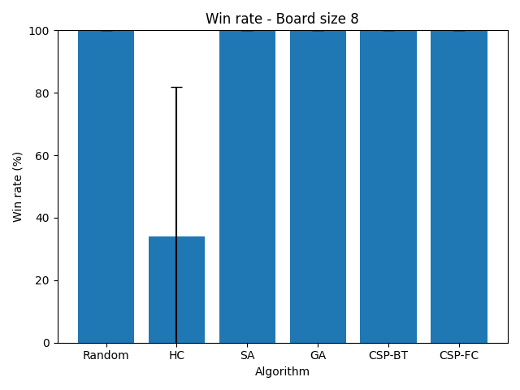
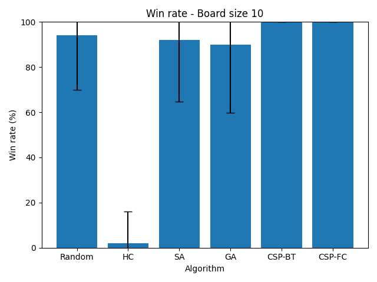
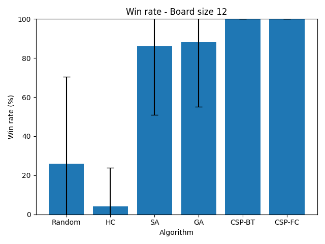


Comparación de valor de H() promedio obtenido por algoritmo, para cada tamaño de tablero.


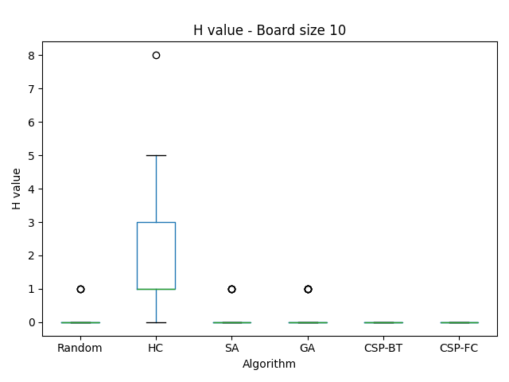
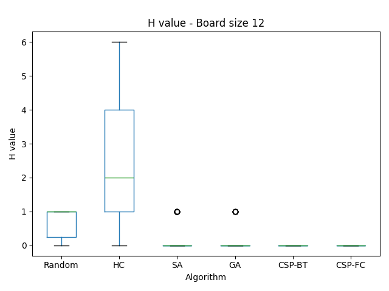


Comparación de tiempo de ejecución por algoritmo, para cada tamaño de tablero.


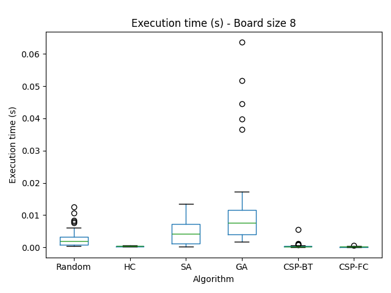

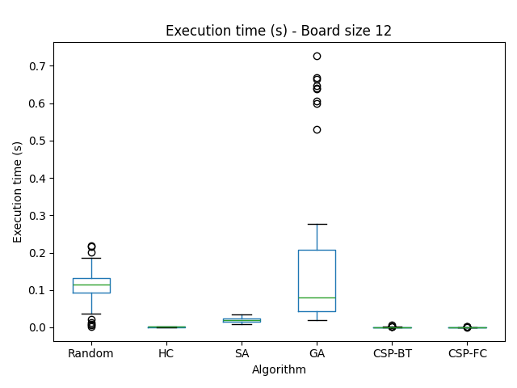


Comparación de cantidad de estados explorados por algoritmo, para cada tamaño de tablero.


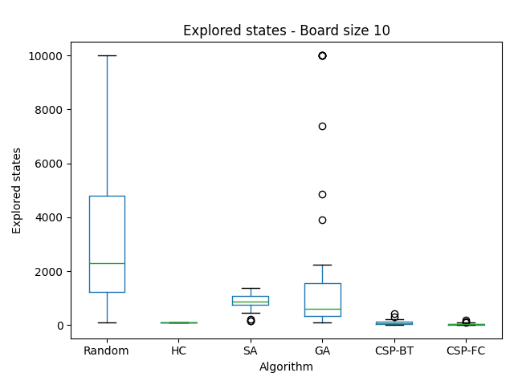


