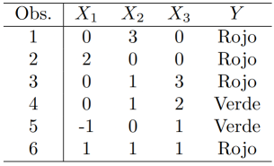

# Trabajo Práctico 7A: Introducción a ML

## Preguntas

### 1. En cada uno de los siguientes ejercicios, indique si en general se espera que un método de aprendizaje de máquinas flexible se comporte mejor o peor que uno inflexible. Justifique su respuesta.

#### a) El tamaño de la muestra n es extremadamente grande, y el número de predictores p es pequeño.

Con muchos datos de entrenamiento, se reduce la varianza de los métodos de aprendizaje, entonces es mejor utilizar un método flexible que permita reducir el sesgo.

#### b) El número de predictores p es extremadamente grande, y el número de observaciones n es pequeño.

Como hay muchos predictores y pocas observaciones, hay mucha varianza en los datos de aprendizaje. Un método flexible haría over fitting al set particular de datos de entrenamiento que tenemos, que no es muy representativo de la relación real. Entonces es conveniente usar un método inflexible, aunque podría tener un sesgo grande.

#### c) La relación entre los predictores y la variable dependiente es altamente no lineal.

Un método flexible se comportará mejor, ya que al tener más parámetros permite representar tal correlación no lineal. Los inflexibles (ej. regresión lineal), no pueden representar estas relaciones.

#### d) La varianza de los términos de error, $σ^2 = Var(ϵ)$, es extremadamente alta.

Como en este caso, los datos de prueba tendrán mucho ruido, sería mejor utilizar un método flexible, que no haga un overfitting al ruido particular de los datos de entrenamiento.

### 2. Explique si cada escenario representa un problema de clasificación o de regresión, e indique si el interés principal es inferir o predecir. Especifique n (cantidad de observaciones) y p (cantidad de predictores) en cada caso.

#### a) Se recopila un conjunto de datos sobre las 500 empresas más importantes de Estados Unidos. Para cada una de las empresas se registran las ganancias, el número de empleados, la industria y el salario del director ejecutivo. Se tiene interés en comprender qué factores afectan el salario de los directores ejecutivos.

* **Tipo de problema**: regresión (salario).

* **Interés principal**: inferencia. Queremos saber cómo se relacionan los predictores con la respuesta, no realizar predicciones de salarios.

* **Tamaño**: n = 500 (empresas) y p = 3 (ganancias, nro. empleados, industria).

#### b) Se está considerando lanzar un nuevo producto y se desea saber si será un éxito o un fracaso. Se recolectan datos de 20 productos similares que fueron lanzados previamente. Para cada producto se ha registrado si fue un éxito o un fracaso, el precio cobrado por el producto, el presupuesto de marketing, el precio de la competencia, y otras diez variables.

* **Tipo de problema**: clasificación (éxito o fracaso).

* **Interés principal**: predicción. Queremos saber si un próximo producto será un éxito o fracaso.

* **Tamaño**: n = 20 (productos) y p = 13 (precio, presupuesto de marketing, precio de la competencia, otras 10 variables).

#### c) Se tiene interés en predecir el % de cambio en el tipo de cambio USD/Euro en relación a los cambios semanales en los mercados de valores mundiales. Para eso se recolectan datos semanalmente durante todo el 2021. Para cada semana se registran el % de cambio de USD/Euro, el % de cambio en el mercado estadounidense, el % de cambio en el mercado británico, y el % de cambio en el mercado alemán.

* **Tipo de problema**: regresión (% de cambio en el tipo de cambio USD/Euro).

* **Interés principal**: predicción. Queremos predecir el cambio en el tipo de cambio futuro.

* **Tamaño**: n = 52 (semanas en 2021) y p = 3 (cambios en los mercados de valores de USA, UK y Alemania).

### 3. ¿Cuáles son las ventajas y desventajas de un enfoque muy flexible (versus uno menos flexible) para la regresión o clasificación? ¿Bajo qué circunstancias podría preferirse un enfoque más flexible a uno menos flexible? ¿Cuándo podría preferirse un enfoque menos flexible?

Ventajas de enfoques flexibles (vs menos flexibles):

* Permite aproximas funciones no lineales.
* Menor sesgo.
* Mejor predicción.

Desventajas de enfoques flexibles (vs menos flexibles):

* Puede resultar en overfitting si n es pequeño o hay mucha varianza.
* Mayor varianza.
* Menor interpretabilidad.

Cuando preferir enfoques flexibles:

* Si la relación entre X e Y es muy no lineal, y tenemos suficientes datos de aprendizaje para representarla.

* Si el objetivo principal es la predicción y no la inferencia (modelos poco interpretables).

Cuando preferir enfoques menos flexibles:

* Si n es pequeño en comparación a p, el ruido irreducible es grande, o creemos que f es lineal.

* El objetivo es la inferencia (a costa de peor predicción, pero modelos más fáciles de interpretar).

### 4. Describa las diferencias entre un enfoque paramétrico y uno no paramétrico. ¿Cuáles son las ventajas y desventajas de un enfoque paramétrico para regresión o clasificación, a diferencia de un enfoque no paramétrico?

Enfoque paramétrico:

* Se asume una forma funcional fija para f (por ejemplo lineal) y se estima un conjunto finito de parámetros.

* Ventajas: simplicidad, menor requerimiento de datos, interpretabilidad (fácil inferencia), computacionalmente eficiente.

* Desventajas: si la forma asumida es incorrecta, el sesgo puede ser grande. Modela mal relaciones complejas.

Enfoque no paramétrico:

* No se asume una forma funcional predeterminada; el método estima f con mayor libertad (p. ej. splines).

* Ventajas: puede adaptarse a muchas formas de f, menor sesgo cuando f es muy no lineal.

* Desventajas: requieren más datos para controlar la varianza, menos interpretable, computacionalmente más costoso y sensibles a overfitting.

### 5. La siguiente tabla muestra un conjunto de entrenamiento que consta de seis observaciones, tres predictores, y una variable dependiente cualitativa.

Suponga que se quiere usar este dataset para predecir Y cuando X1 = X2 = X3 = 0 usando K vecinos más cercanos.

#### a) Calcule la distancia Euclidiana entre cada observación y el punto de prueba X1 = X2 = X3 = 0.

Calculamos la distancia con $\sqrt{X_1^2+X_2^2+X_3^2}$

| Obs | Distancia | Color |
|-----|-----------|-------|
|  1  | 3.00      | Rojo  |
|  2  | 2.00      | Rojo  |
|  3  | 3.16      | Rojo  |
|  4  | 2.24      | Verde |
|  5  | 1.41      | Verde |
|  6  | 1.73      | Rojo  |

#### b) ¿Cuál es la predicción con K = 1? Justifique.

Usamos la observación más cercana, que es la 5, con Y = Verde. Entonces la predicción es Y = Verde.

#### c) ¿Cuál es la predicción con K = 3? Justifique.

Los 3 vecinos más cercanos son:

| Obs | Distancia | Color |
|-----|-----------|-------|
|  5  | 1.41      | Verde |
|  6  | 1.73      | Rojo  |
|  2  | 2.00      | Rojo  |

La mayoría son rojos, entonces la predicción es Y = Rojo.

#### d) Si el límite de decisión de Bayes en este problema es altamente no lineal, ¿se espera que el mejor valor para K sea grande o pequeño? ¿Por qué?

Si la frontera es muy no lineal, entonces se necesita un modelo más flexible. En KNN, la flexibilidad aumenta a medida que se reduce K, por lo tanto se espera que el mejor valor para K sea pequeño