# Trabajo Práctico 7B: Machine Learning

## Parte 1

### 2. A partir del archivo arbolado-mendoza-dataset-train.csv responder las siguientes preguntas:

#### a) ¿Cual es la distribución de las clase inclinación_peligrosa?

Los siguiente gráficos muestran la frecuencia absoluta y relativa de la variable inclinación peligrosa.

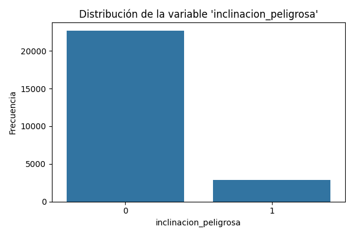

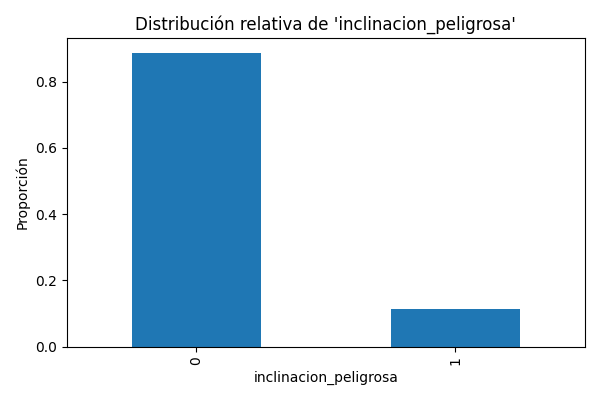

Hay 2.868 (11,23%) árboles peligrosos y 22.661 (88,77%) no peligrosos.

#### b) ¿Se puede considerar alguna sección más peligrosa que otra?

Hay dos posibles criterios que podríamos usar para responder esta pregunta. Uno es la cantidad de árboles con inclinación peligrosa por sección, o si no el porcentaje de árboles con inclinación peligrosa por sección.

El primer criterio nos dice la cantidad de árboles peligroso, mientras que el segundo nos dice, dado un árbol cualquiera de la sección, qué tan probable es que sea peligroso.

El siguiente gráfico muestra la frecuencia absoluta de árboles con inclinación peligrosa por sección.

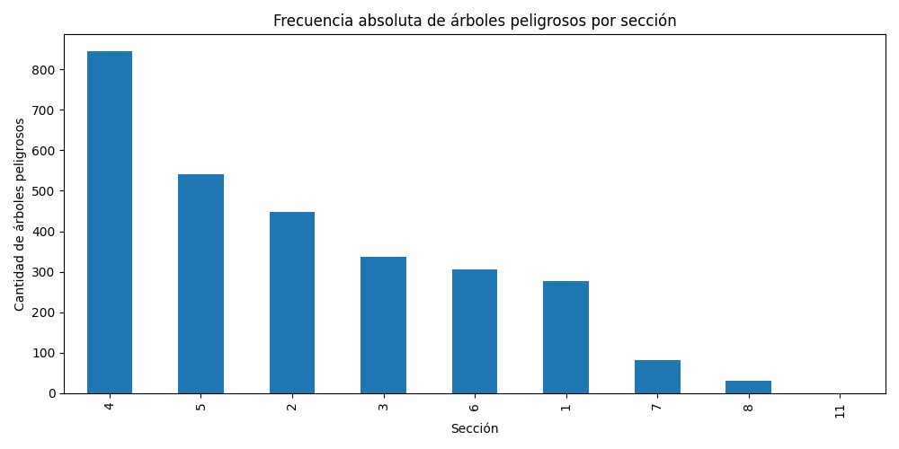

Podemos ver que la 4a. sección es la que más cantidad de árboles peligrosos tiene, con casi el doble de árboles peligroso que la siguiente sección más peligrosa (5a. sección).

El siguiente gráfico muestra la frecuencia relativa de árboles con inclinación peligrosa por sección.

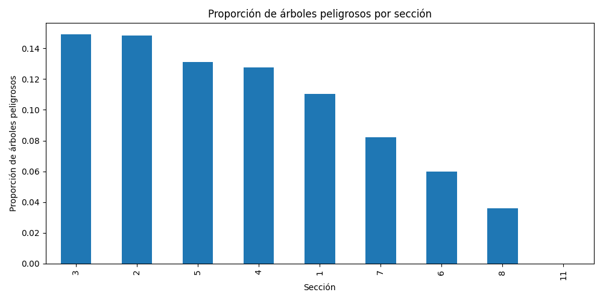

Según este criterio, las secciones más peligrosas son la 3a. y la 4a., con aproximadamente un 15% de árboles peligrosos, seguidas de la 5a. y 4a., con alrededor de 13%.

El primer criterio no es ideal si el muestreo de cada sección no fue proporcional a la cantidad de árboles que contiene cada una.

#### c) ¿Se puede considerar alguna especie más peligrosa que otra?

En este caso, el criterio correcto a utilizar es la frecuencia absoluta de árboles con inclinación peligrosa por especie. La frecuencia absoluta presentará un sesgo hacia las especies más comunes.

El siguiente gráfico muestra la frecuencia relativa de árboles peligrosos por especie.

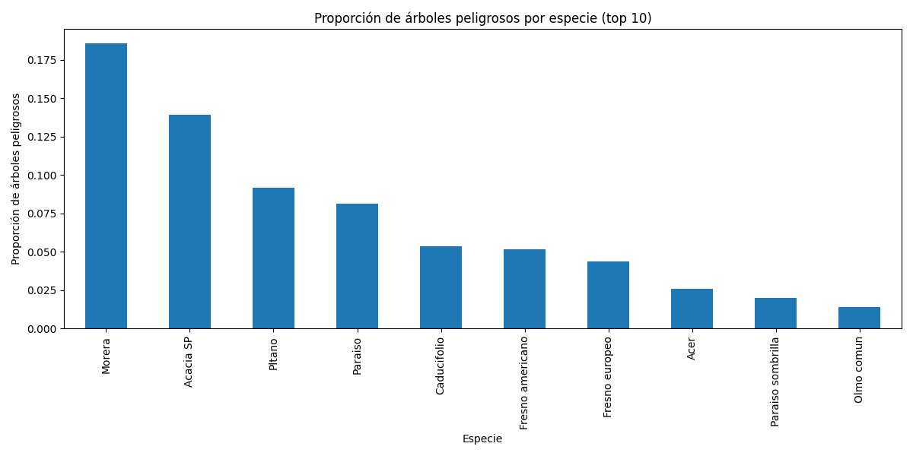

Podemos ver que las especies Morera y Acacia sp. son las especies con mayor porcentaje de árboles con inclinación peligrosa, con aprox. 18% y 14%, respectivamente. La especie más segura sería el Olmo común.

### 3. A partir del archivo arbolado-mendoza-dataset-train.csv:

#### a) Histogramas de frecuencia para la variable circ_tronco_cm con 20, 30 y 50 bins.

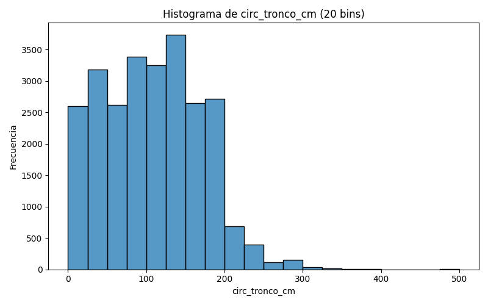

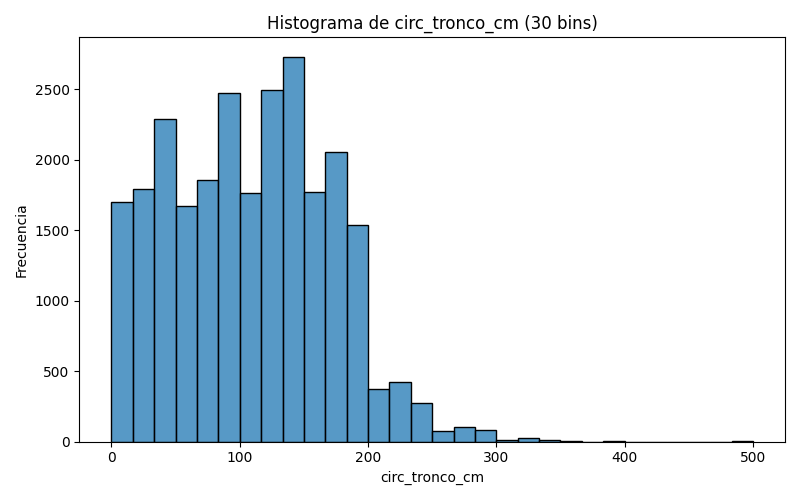

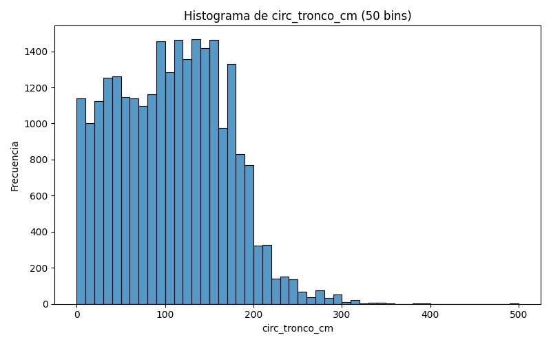

#### b) Histogramas de frecuencia para la variable circ_tronco_cm separando por clase de la variable inclinacion_peligrosa con 20, 30 y 50 bins.

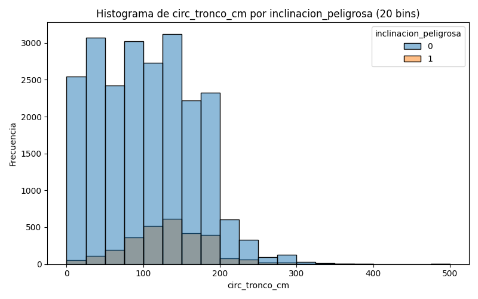

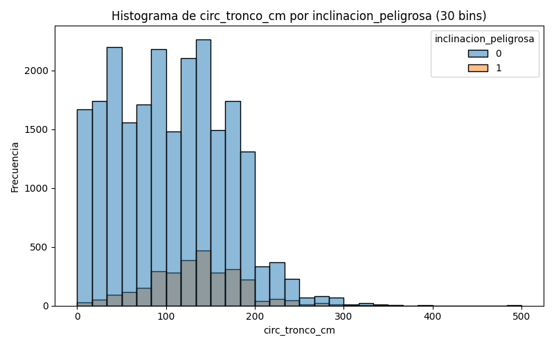

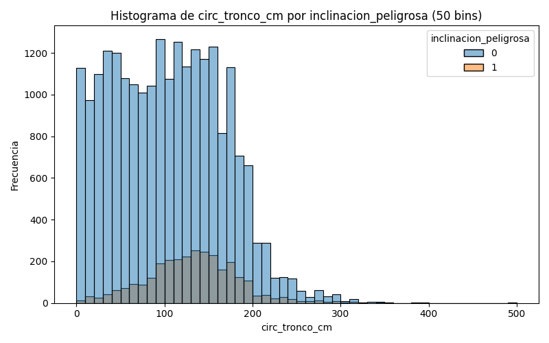

#### c) Crear una nueva variable categórica de nombre circ_tronco_cm_cat a partir circ_tronco_cm, en donde puedan asignarse solo 4 posibles valores [muy alto, alto, medio, bajo]. Utilizar la información del ejercicio (3a) para seleccionar los puntos de corte para cada categoría. Guardar el nuevo dataframe con el nombre arbolado-mendoza-dataset-circ_tronco_cm-train.csv

Se utilizaron los cuartiles como criterio de corte para categorizar la variable circ_tronco_cm. Los mismos son:

$Q_1 = 58.0\,\text{cm}$

$Q_2 = 110.0\,\text{cm}$

$Q_3 = 156.0\,\text{cm}$
